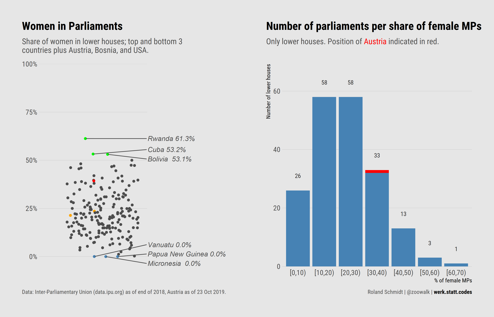

```{r setup, include=FALSE}
knitr::opts_chunk$set(echo = T)
library(tidyverse)
library(ggrepel)
```

# Context
So, Austria has a new parliament. Following the elections in September, the new lower house got constituted yesterday and as a few noted it is more diverse than previous ones. [Here](https://www.derstandard.at/story/2000110261600/fuehlen-sie-sich-im-parlament-vertreten?ref=rec)'s a nice visualization if you want to get a quick overview. Among others, it was the share of women in parliament which was particularly often noted. None of Austria's previous lower houses had an as high share of women at the start of a new legislative period. This made me a bit curious how Austria's lower house actually compares to other countries. First I'll show the results, then how to get there in R. The entire code is available at my github [account](https://github.com/zoowalk/women_in_parliaments).

# Result


```{r fig.height=20, echo=F, code_folding=NULL}

```


So, how is Austria doing? Well, not bad if compared with most other countries. However, given that there are only four (!) countries in which women are at least represented on par with men (min 50 %) it's overall quite a sobering affair. Don't get me started on Papua New Guinea...


# How to get there

## Getting the data
Data comes from the Inter-Parliamentary Union, based in Geneva, which seeks to strengthen international cooperation between parliaments and support their work.

```{r, eval=F}
df <- readr::read_csv(
  file = "https://data.ipu.org/api/women-ranking.csv?load-entity-refs=taxonomy_term%2Cfield_collection_item&max-depth=2&langcode=en&month=9&year=2019",
  skip = 5
)

names(df) <- c(
  "rank", "country",
  "lower_elections", "lower_seats", "lower_women_abs", "lower_women_rel",
  "upper_elections", "upper_seats", "upper_women_abs", "upper_women_rel"
)

df <- df %>%
  mutate_at(vars(contains("lower"), contains("upper")), .funs = list(num = ~ as.numeric(.))) %>%
  mutate(country = stringr::str_remove_all(country, regex("\\(.*\\)") %>% str_trim()))
```

## Dotplot: Connecting dots with labels

As for the dotplot, when it comes to annotating data `ggrepel` is your friend.

Creating the dot plot essentially entailed two critical points. First, the plotting of the dots. To avoid over-plotting, the position argument of `geom_point` introduces a random variation. Note that the seed of the `position` argument is set in advance with the  `position_jitter` command. This is critical since the same seed has to be used when subsequently placing the labels and connecting lines. If you don't use the same seeds, dots and labels would be positioned with different random values and consequently not match.

The second part, which took me a while to figure out, is the creation of an additional variable/label (`label2`). This label is empty for those countries which we do not want to label. While 'normally' one could use a different dataframe for the annotation, this avenue seems not to be possible since the dependency on the same (random) position would get messed up. Hence, this approach does not create filtered additional dataset, but uses the entire set but only provides labels for those countries which we want to highlight. 

More details can be found in the `ggrepel` vignette and at this pertaining [issue](https://github.com/slowkow/ggrepel/issues/123) filed on github.

```{r, eval=F}
pos <- position_jitter(width = 0.2, seed = 1) #define seed for positioning

df %>%
  mutate(label2 = paste(country, scales::percent(lower_women_rel_num / 100,
    accuracy = .1))) %>%
  mutate(label2 = case_when(     #create label only for thos countries you want to highlight
    indicator == "other" ~ "",
    TRUE ~ as.character(label2))) %>%
  ggplot(., aes(
    x = .5,
    y = lower_women_rel_num,
    color = indicator,
    label = label2,
    group = country)) +
  geom_point(
    position = pos  #same pos
  ) +
  geom_rect(
    xmin = 0.75,
    xmax = Inf,
    ymin = -Inf,
    ymax = Inf,
    color = "white",
    fill = "white"
  ) +
  geom_text_repel(
    xlim = c(.75, 1.2),
    position = pos,  #same pos
    fontface = "italic",
    color = "grey30",
    segment.color = "grey30",
    hjust = 0
  ) +
  labs(
    title = "Women in Parliaments",
    subtitle = "Share of women in lower houses; top and bottom 3 \ncountries plus Austria, Bosnia, and USA.",
    caption = c("Data: Inter-Parliamentary Union (data.ipu.org) as of end of 2018, Austria as of <br>23 Oct 2019.", "<br><br><br>Roland Schmidt | @zoowalk | <span style='color:black'>**werk.statt.codes**</span>")
  ) +
  scale_y_continuous(
    limits = c(-5, 100),
    breaks = seq(0, 100, 25),
    minor_breaks = NULL,
    expand = expansion(mult = c(0.1, 0)),
    labels = scales::percent_format(scale = 1, accuracy = 1)
  ) +
  scale_x_continuous(
    expand = expansion(mult = 0),
    limits = c(0.15, 1.2)
  ) +
  scale_color_manual(values = c(
    "Austria" = "red",
    "other" = "grey30",
    "top" = "green",
    "bottom" = "steelblue",
    "select" = "orange"
  )) +
  hrbrthemes::theme_ipsum_rc() +
  theme(
    panel.grid.major.x = element_blank(),
    panel.grid.minor.x = element_blank(),
    plot.subtitle = element_text(color = "grey30"),
    legend.position = "none",
    plot.title.position = "plot",
    plot.caption.position = "plot",
    plot.caption = element_markdown(color = "grey30", hjust = c(0, 1)),
    axis.title = element_blank(),
    axis.text.x = element_blank())
```

## Barplot

As for the barplot, I'll only light to highlight the `cut` function. It's simple as powerful when it comes to cutting continuous variables into factors. Note the` right=F` argument to open intervals on the left side. 

```{r, eval=F}
df_interval <- df %>% 
  mutate(women_interval=cut(x=lower_women_rel_num, 
                            breaks=seq(0,100,10),
                            right=F)) %>% 
  mutate(women_interval=forcats::fct_explicit_na(women_interval, na_level=">70")) %>% 
  mutate(indicator = case_when(
    str_detect(country, "Austria") ~ "Austria",
    TRUE ~ "other"
  ))

plot_distribution <- df_interval %>% 
  ggplot()+
  geom_bar(aes(x=women_interval,
               fill=indicator),
           stat="count") +
  geom_text(aes(x=women_interval, 
                label=..count..),   
            stat="count",
            nudge_y=5)+
  labs(title="Number of parliaments per share of female MPs",
       subtitle=paste("Only lower houses.","Position of <span style='color:red'>Austria</span> indicated in red."),
       caption = c("Data: Inter-Parliamentary Union (data.ipu.org) as of end of 2018, Austria as of <br>23 Oct 2019.", "<br><br><br>Roland Schmidt | @zoowalk | <span style='color:black'>**werk.statt.codes**</span>"),
       x="% of female MPs",
       y="Number of lower houses")+
  scale_y_continuous(expand=expansion(mult=c(0.01,0.1)))+
  scale_fill_manual(values=c("Austria"="red", "other"="steelblue"))+
  hrbrthemes::theme_ipsum_rc()+
  theme(panel.grid.major.x = element_blank(),
        panel.grid.minor.x = element_blank(),
        panel.grid.minor.y = element_blank(),
        legend.position = "none",
        plot.title.position = "plot",
        plot.caption.position = "plot",
        plot.subtitle = element_markdown(color= "grey30"),
        plot.caption = element_markdown(color = "grey30", hjust = c(0, 1)),
        )

```

