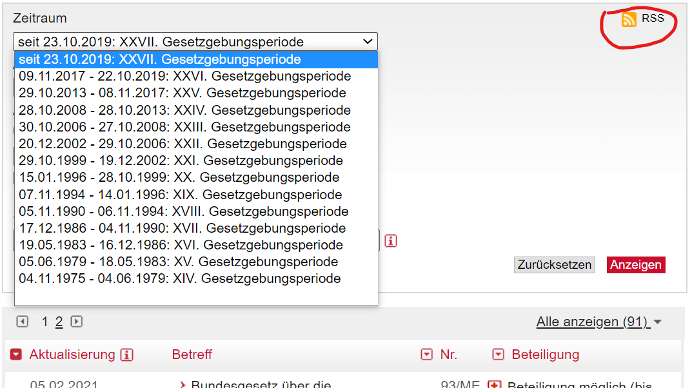
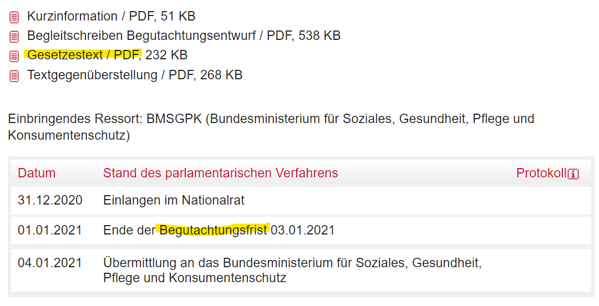
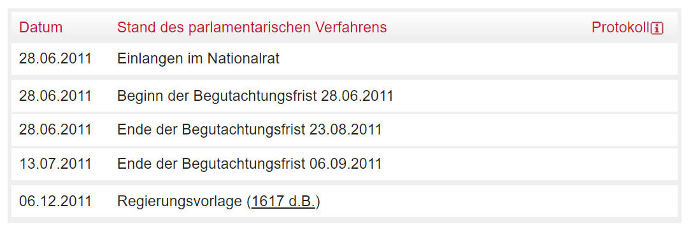

```{r setup, include=FALSE}
library(tidyverse)
library(xml2)
library(rvest)
library(ggtext)
library(paletteer)
library(ggiraph)
library(reactable)
library(svglite)
knitr::opts_chunk$set(echo = T)

plot_bg_color <- readr::read_file(file=here::here("theme.css")) %>% 
  str_extract(., regex("(?<=blog-bg-color:).*?(?=;)")) %>%
  str_trim() %>% 
  str_extract(., regex("^#\\S+"))

caption <- "Data: https://www.parlament.gv.at; XIV (4.11.1975) to XXVII (as of 24.01.2021) legislative period.\nAnalysis: Roland Schmidt | @zoowalk | https://werk.statt.codes"

theme_post <- function() {
  hrbrthemes::theme_ipsum_rc() +
    theme(
      plot.background = element_rect(fill = plot_bg_color, color=NA),
      panel.background = element_rect(fill = plot_bg_color, color=NA),
      #panel.border = element_rect(colour = plot_bg_color, fill=NA),
      #plot.border = element_rect(colour = plot_bg_color, fill=NA),
      plot.margin = margin(l = 0, 
                           t = 0.25,
                           unit = "cm"),
      plot.title = element_text(
        color = "grey20",
        face = "bold",
        margin = margin(l = 0, unit = "cm"),
        size = 13
      ),
      plot.title.position = "plot",
      plot.subtitle = element_text(
        color = "grey50",
        margin = margin(t = 0.2, b = 0.3, unit = "cm"),
        size = 11
      ),
      plot.caption = element_text(
        color = "grey50",
        size = 8,
        hjust = c(0)
      ),
      plot.caption.position = "panel",
      axis.title.x = element_text(
        angle = 0,
        color = "grey50",
        hjust = 1
      ),
      axis.text.x = element_text(
        size = 9,
        color = "grey50"
      ),
      axis.title.y = element_blank(),
      axis.text.y = element_text(
        size = 9,
        color = "grey50"
      ),
      panel.grid.minor.x = element_blank(),
      panel.grid.major.x = element_blank(),
      panel.grid.minor.y = element_blank(),
      panel.spacing = unit(0.25, "cm"),
      panel.spacing.y = unit(0.25, "cm"),
      strip.text = element_text(
        angle = 0,
        size = 9,
        vjust = 1,
        face = "bold"
      ),
      legend.title = element_text(
        color = "grey30",
        face = "bold",
        vjust = 1,
        size = 9
      ),
      legend.text = element_text(
        size = 9,
        color = "grey30"
      ),
      legend.justification = "left",
      legend.box = "horizontal", # arrangement of multiple legends
      legend.direction = "vertical",
      legend.margin = margin(l = 0, t = 0, unit = "cm"),
      legend.spacing.y = unit(0.07, units = "cm"),
      legend.text.align = 0,
      legend.box.just = "top",
      legend.key.height = unit(0.2, "line"),
      legend.key.width = unit(0.5, "line"),
      text = element_text(size = 5)
    )
}


rt_theme <- reactableTheme(backgroundColor = plot_bg_color,
                           style=list(fontFamily="Roboto Condensed",
                                      fontSize="12px"),
                           tableBodyStyle=list(lineHeight="100%"),
                           filterInputStyle = list(
                             color="black",
                             backgroundColor = plot_bg_color))


```

# Context
This is an addition to my previous posts on COVID related legislation in Austria. 

Over New Year (!), the Austrian government introduced another bill with the aim to get a grip on the COVID pandemic. With the speed with which things have been developping and the flurry of hard/soft/de facto lockdowns, I have to confess that I would have to look into the text to recall the changes introduced by bill 88/ME (XXVII) (in full: *'Epidemiegesetz, COVID-19-Maßnahmengesetz, Änderung'*). However, what made the bill memorable even during these times was its legislative genesis, with the government limiting the public consultative process to only three days. As mentioned in previous posts, Austria's legislative procedure includes a public consultation process which allows citizens, NGOs, churches etc. to file submissions in which they can raise concerns and provide feedback on the draft law. At least in theory, it's a feedback loop which allows the government to solicit input and revise its bills.

Unsurprisingly, at least to me, the government was harshly criticized for this short consultation period and accused of rendering any meaningful consideration impossible. I am no expert on the legislative process, but a quick Google search led me to a [circular](https://www.bundeskanzleramt.gv.at/dam/jcr:32bd35f3-2815-42ab-b276-be8aaba18124/RS_600614Begutachtungsfristen.doc){target="_blank"} from 2008 in which the Chancellery's own constitutional service urged ministries to provide a consultative period of at least six weeks. In contrast, some pointed out that the bill had only three pages and that - in light of the urgency due to a pandemic - three days should suffice to read and comment on the bill. 

This debate made me wonder how long other bills were open for the consultative process and how bill 88/ME (XXVII) would compare, also when considering their documents' lengths. To answer these questions, I a) extracted from the parliament's website the start and end dates of all bill's consultative period since 1975, *as published on the parliament's website*. Based on these dates I calculated the length of the consultative process; b) downloaded the text of all pertaining bills and retrieved their number of pages. Putting the length of the consultation process and the length of the bill together should allow to better evaluate the three day notice for the amendment to the epidemic bill.

I'll first present the results and other stuff I found noteworthy, and then focus on some of the required steps in R to obtain them. The raw dataset containing the consolidated results is [here](#datatable).

```{r chunk_get_bills_overview, eval=F, code_folding=NULL, include=F}
fn_get_bill_overview <- function(rss_feed){
  
  df_rss <- xml2::read_xml(rss_feed)
  data <- xml_child(df_rss, 1)
  
  df_bill_pages_link <- data %>% 
    xml2::xml_find_all("//link") %>% 
    html_text() %>% 
    enframe(., 
            name="id",
            value="link_single_bill_page") %>% 
    mutate(link_single_bill_page=str_squish(link_single_bill_page)) %>% 
    filter(id>2) #removes first two rows which don't include data on bills
  
  #get title
  df_bill_pages_name <- data %>% 
    xml2::xml_find_all("//title") %>% 
    html_text() %>% 
    enframe(., 
            name="id",
            value="title") %>% 
    # mutate(name=str_extract(title, regex("(?<=\\>).*(?=\\<)"))) %>% 
    mutate(title=str_trim(title)) %>% 
    filter(id>2) 
  
  #get publication date
  df_bill_pages_pub_date <- data %>% 
    xml2::xml_find_all("//pubDate") %>% 
    html_text() %>% 
    enframe(., 
            name="id",
            value="date") %>% 
    mutate(date=date %>% str_squish() %>% lubridate::dmy_hms(., tz="Europe/Vienna"))
  
  #combine to one dataframe
  df_bill <- bind_cols(
    df_bill_pages_name,
    df_bill_pages_pub_date,
    df_bill_pages_link,
  ) %>% 
    select(-contains("id"))
  
  df_bill %>% 
    mutate(indicator_me_numeric=str_extract(link_single_bill_page, regex("(?<=_)\\d*"))) %>% 
    mutate(indicator_me=glue::glue("{as.numeric(indicator_me_numeric)}/ME")) %>% 
    mutate(rss_link_submissions=glue::glue("https://www.parlament.gv.at/PAKT/VHG/XXVII/ME/ME_{indicator_me_numeric}/filter.psp?view=RSS&jsMode=&xdocumentUri=&filterJq=&view=&GP=XXVII&ITYP=ME&INR={as.numeric(indicator_me_numeric)}&SUCH=&listeId=142&FBEZ=FP_142
"))
  
}

# create vec wtih rss links -----------------------------------------------

periods <- as.roman(seq(14, 27, 1)) #freaking nice
rss_links <- glue::glue("https://www.parlament.gv.at/PAKT/MESN/filter.psp?view=RSS&jsMode=&xdocumentUri=&filterJq=&view=&GP={periods}&MESN=ME&R_MESN=ME&MIN=ALLE&SUCH=&listeId=102&FBEZ=FP_002")

df_bills_all <- rss_links %>% 
  purrr::set_names() %>% 
  map_dfr(., fn_get_bill_overview, .id="rss_links")

# readr::write_csv2(df_bills_all, file=here::here("_blog_data",
#                                           "2021_covid_consultation_duration",
#                                           "df_bills_all.csv"))

```

```{r chunk_fn_consult, eval=F, code_folding=NULL, include=F}
#function to extract details (duration and pdf links) from bills' overview
fn_consult <- function(link_bill)  {

  df_consultation_dates <- link_bill %>% 
    read_html() %>% 
    html_nodes("#content > div.contentBlock.tabs-responsive__contentBlock > div:nth-child(2) > table") %>% 
    html_table() %>% 
    map_df(., bind_rows) %>% 
    janitor::clean_names() %>% 
    filter(str_detect(stand_des_parlamentarischen_verfahrens, regex("Begutachtungsfrist"))) %>% 
    rename(date_start=datum) %>% 
    mutate(date_end=str_extract(stand_des_parlamentarischen_verfahrens, regex("\\d{2}\\.\\d{2}\\.\\d{4}"))) %>% 
    select(-protokoll)
  
  # get link to text of bill - define function ---------------------------------------------------------
  
df_link_text <-   link_bill %>% 
    read_html() %>% 
    html_nodes(xpath="//a[contains(text(), 'Ministerialentwurf') 
                and contains(text(), 'PDF') 
                or contains(text(), 'Gesetzestext')
                or contains(text(), 'Entwurf')]") %>%  #works! case sensetive
    html_attr("href")  %>% 
   tibble::enframe(name=NULL, value="link_bill_pdf") %>% 
   mutate(link_bill_pdf=paste0("https://www.parlament.gv.at/", link_bill_pdf))
  
  bind_cols(df_consultation_dates, df_link_text) %>% 
    select(text_raw="stand_des_parlamentarischen_verfahrens", date_start, date_end,
           link_bill_pdf)
  
}

#APPLY FUNCTION
tbl_missing <- tibble(link_single_bill_page=NA_character_, text_raw=NA_character_, date_start=NA, date_end=NA, link_bill_pdf=NA_character_)

library(furrr)
plan(multisession, workers = 2)

df_res <- df_bills_all$link_single_bill_page %>% 
  purrr::set_names() %>% 
  future_map_dfr(., possibly(fn_consult, otherwise=tbl_missing), .id="link_single_bill_page",
                 .progress=T) %>% 
  select(link_single_bill_page, text_raw, date_start, date_end, link_bill_pdf) 

df_res <- df_res %>% 
  mutate(across(.cols=contains("date"), lubridate::dmy)) %>% 
  mutate(legis_period=str_extract(link_single_bill_page, regex("[^/]*?(?=/ME/)"))) %>% 
  mutate(bill_id=str_extract(link_single_bill_page, regex("ME_.*?(?=/)"))) 

df_res <- df_res %>% 
  left_join(., df_bills_all %>% 
  select(link_single_bill_page, title))

# readr::write_csv2(df_res, file=here::here("_blog_data",
#                                           "2021_covid_consultation_duration",
#                                           "df_res.csv"))

```

```{r chunk_duration, eval=T, code_folding=NULL, include=F}
df_res <-  readr::read_csv2(file=here::here("_blog_data", "2021_covid_consultation_duration",
                                           "df_res.csv")) %>% 
    mutate(across(.cols=contains("date"), lubridate::ymd))

#remove dupes due to multiple pdf documents
df_duration <- df_res %>% 
  distinct(link_single_bill_page, 
           text_raw, 
           date_start, date_end, 
           legis_period, bill_id, title)

df_duration_mult <- df_duration %>% 
  group_by(link_single_bill_page, legis_period, bill_id, title) %>% 
  mutate(n_obs_duration=n()) %>% 
  ungroup()

df_dates_missing <- df_duration_mult %>% 
  filter(if_any(starts_with("date"), is.na)) #new w dplyr 1.04
nrow(df_dates_missing) #23

df_duration_collected <- df_duration_mult %>% 
  filter(!is.na(date_start) & !is.na(date_end)) %>%  #remove those with missing dates
  group_by(link_single_bill_page, legis_period, bill_id, title) %>% 
  summarize(date_start_min=min(date_start, na.rm = T),
         date_end_max=max(date_end, na.rm = T),
         n_obs_duration=mean(n_obs_duration),
         dates_collected=paste(paste(as.character(date_start), "to", 
                              as.character(date_end)),
         collapse="; ")) %>% 
         # dates_collected=list(paste(as.character(date_start), "to", 
         #                      as.character(date_end)))) %>% 
  mutate(duration_collected=date_end_max-date_start_min+1) %>% 
  ungroup()

table(df_duration_collected$duration_collected<0)
#109 with neg duration
table(df_duration_collected %>% 
        filter(duration_collected<0) %>% 
        pull(n_obs_duration)) #all negatives have only one table row on duration

#check those negative duration
df_negative <- df_duration_collected %>% 
  filter(duration_collected<0)
#randomly checked source; appears to be errors in data collection/source;
#remove these from further analysis

table(df_duration_collected$n_obs_duration)
#3 obs - check:OK
# https://www.parlament.gv.at/PAKT/VHG/XXIV/ME/ME_00294/index.shtml

#2 obs - check
#https://www.parlament.gv.at/PAKT/VHG/XXIII/ME/ME_00139/index.shtml - ok
#https://www.parlament.gv.at/PAKT/VHG/XX/ME/ME_00361/index.shtml - ok
#https://www.parlament.gv.at/PAKT/VHG/XX/ME/ME_00153/index.shtml - ok


```

```{r BILL_LENGTH, eval=F, code_folding=NULL, include=F}
df_pages <- df_res %>% 
  select(link_single_bill_page, link_bill_pdf, 
         legis_period, bill_id, title) %>% 
  distinct() %>% #remove duplicates
  filter(link_single_bill_page %in% df_duration_collected$link_single_bill_page) %>% #only for those where we have valid durations
  mutate(file_name=str_extract(link_bill_pdf, regex("[^\\/]*pdf$"))) %>% 
  mutate(file_name=glue::glue("{legis_period}_{bill_id}_{file_name}")) %>% 
  mutate(download_destination=glue::glue("{here::here('_blog_data',
                                         '2021_covid_consultation_duration',
                                         'bills_pdf')}/{file_name}") %>%
           as.character() %>% 
           str_trim(., side=c("both"))) 

#download laws
safe_download <- safely(~ download.file(.x , .y, mode = "wb", quiet=T))

library(magrittr)
df_pages  %$%
  purrr::walk2(
    link_bill_pdf,
    download_destination,
    safe_download, 
    mode = "wb")

```

```{r get_pages, eval=F, code_folding=NULL, include=F}
# get page number ---------------------------------------------------------

library(pdftools)

df_pages <- df_pages %>% 
  filter(link_single_bill_page %in% df_duration_collected$link_single_bill_page) %>% 
  mutate(pdf_details=map(download_destination, possibly(pdftools::pdf_info, otherwise = NA_integer_))) %>% 
  mutate(pdf_pages=map_dbl(pdf_details, purrr::pluck, "pages", .default=NA)) %>% #note default=NA, not NULL
  select(-pdf_details)

# readr::write_excel_csv2(df_pages, file=here::here("_blog_data", "2021_covid_consultation_duration", "df_pages.csv"))

df_pages <- readr::read_csv2(here::here("_blog_data", "2021_covid_consultation_duration", "df_pages.csv"))

df_pages_collected <- df_pages %>% 
  distinct() %>% #double check to remove duplicates
  group_by(link_single_bill_page) %>% 
  summarise(pdf_pages_sum=sum(pdf_pages, na.rm = T),
            n_obs_docs=n())

```

```{r COMBINE_DURATION_AND_BILL_LENGTH, eval=F, code_folding=NULL, include=F}
df_consolidated <- df_duration_collected %>% 
  left_join(., df_pages_collected)

# nrow(df_duration_collected)
# nrow(df_pages_collected)
# nrow(df_consolidated)

# readr::write_excel_csv2(df_consolidated, 
#                         file=here::here("_blog_data", "2021_covid_consultation_duration", "df_consolidated.csv"))

```

```{r message=FALSE, warning=FALSE, include=FALSE, code_folding=NULL}
df_consolidated <- readr::read_csv2(file=here::here("_blog_data", "2021_covid_consultation_duration", "df_consolidated.csv"))

#create link to rss submission feeds for all bills
df_consolidated <- df_consolidated %>% 
  mutate(rss_submissions=glue::glue('https://www.parlament.gv.at/PAKT/VHG/{legis_period}/ME/{bill_id}/filter.psp?view=RSS&jsMode=&xdocumentUri=&filterJq=&view=&GP={legis_period}&ITYP=ME&INR={str_extract(bill_id, regex("[:digit:]*$")) %>% as.numeric()}&SUCH=&listeId=142&FBEZ=FP_142'))

```

```{r GET_SUBMISSIONS, include=FALSE, eval=FALSE, code_folding=NULL}
# get dates of all submissions
# check whether they fall within the calculated dates of the consultation period as  provided on the bill's overview page

#function to extract details of submissions
fn_submission_details <- function(link) {
  
submission_rss_feed <- xml2::read_xml(link)

#get link to subpages with link to submissions
df_submission_link <- submission_rss_feed %>% 
  xml2::xml_find_all("//link") %>% 
  html_text() %>% 
  enframe(., 
          name="id",
          value="link_single_submission_page") %>% 
  mutate(link_single_submission_page=str_squish(link_single_submission_page)) %>% 
  filter(id>2)

#get title
df_submission_title <- submission_rss_feed %>% 
  xml2::xml_find_all("//title") %>% 
  html_text() %>% 
  enframe(., 
          name="id",
          value="title") %>% 
  mutate(name=str_extract(title, regex("(?<=\\>).*(?=\\<)"))) %>% 
  filter(id>2) %>% 
  select(-title)

#get publication date
df_submission_date <- submission_rss_feed %>% 
  xml2::xml_find_all("//pubDate") %>% 
  html_text() %>% 
  enframe(., 
          name="id",
          value="date") %>% 
  mutate(date=date %>% str_squish() %>% lubridate::dmy_hms(., tz="Europe/Vienna"))

#combine to one dataframe
df_submissions <- bind_cols(
  df_submission_link,
  df_submission_title,
  df_submission_date,
  ) %>% 
  select(-contains("id"))

df_submissions
  
}

df_missing <- tibble(link_single_submission_page=NA_character_,
                     name=NA_character_,
                     date=NA)

df_submissions_pages <- df_consolidated$rss_submissions %>% 
  purrr::set_names() %>% 
  map_dfr(., possibly(fn_submission_details, otherwise=df_missing), .id="rss_submissions")

#fills with details to all (!) submissions over entire period
# readr::write_excel_csv2(df_submissions_pages, file=here::here("_blog_data", "2021_covid_consultation_duration", "df_submissions_pages.csv"))
```

```{r GET_SUBMISSIONS_2, include=FALSE, eval=T, code_folding=NULL}
df_submissions_pages <- readr::read_csv2(file=here::here("_blog_data",
                                                         "2021_covid_consultation_duration", "df_submissions_pages.csv"))

#number of submissions per bill
df_submissions_per_bill <- df_submissions_pages %>% 
  group_by(rss_submissions) %>% 
  summarise(n_obs_submissions=n())


df_consolidated <- df_consolidated %>% 
  left_join(.,
            df_submissions_per_bill) %>% 
  mutate(covid_bills=case_when(legis_period=="XXVII" &
                                 str_detect(title, "Epidemie") ~ "covid-19",
                               TRUE ~ as.character("other"))) %>% 
  mutate(covid_measures_bill=case_when(bill_id=="ME_00088" & legis_period=="XXVII" ~ "COVID-19-Maßnahmengesetz",
TRUE ~ as.character("other")))

```

```{r chunk_pl_submissions_per_bill, include=FALSE, code_folding=NULL}
pl_submissions_per_bill<- df_consolidated %>% 
  mutate(bill_indicator=case_when(str_detect(title, "Epidemie") & legis_period=="XXVII" ~ "yes",
                                  TRUE ~ as.character("no"))) %>% 
  ungroup() %>% 
  ggplot()+
  labs(title="LEGISLATIVE CONSULTATION PROCESS:<br>Number of filed submissions per bill.",
       subtitle="Note log scale of y-axis.",
       x="Date",
       y="Number of submissions (log scale)",
       caption=caption)+
  geom_segment(aes(x=as.Date("2017-01-01"),
               xend=as.Date("2017-01-01"),
               y=0,
               yend=4000),
               color="grey50")+
  geom_text(label=str_wrap("Introduction of possibility to file electronic submissions via parliament's website",30),
            aes(x=as.Date("2016-06-01"),
            y=6000),
            color="grey50",
            lineheight=0.7,
            check_overlap = T,
            hjust=1,
            vjust=1,
            size=3,
            family="Roboto condensed")+
  geom_jitter_interactive(aes(x=date_end_max,
               y=n_obs_submissions,
               tooltip=glue::glue("{str_wrap(title, 40)}
                                  Number of submissions: {n_obs_submissions}
                                  Bill ID: {bill_id}/{legis_period},
                                  
                                  Click to open submission page"),
               onclick=paste0('window.open("', link_single_bill_page, '#tab-Stellungnahmen', '")'),
               color=bill_indicator))+
    geom_text(label=str_wrap("Epidemiegesetz, COVID-19-Maßnahmengesetz, Änderung (88/ME)
", 40),
aes(x=as.Date("2021-01-01"),
    y=19000),
color="firebrick",
lineheight=0.7,
check_overlap = T,
hjust=1,
size=3,
family="Roboto Condensed")+
  scale_x_date(breaks=c(seq.Date(as.Date("1990-01-01"), as.Date("2020-01-01"), by="10 year"), as.Date("2017-01-01"),
                        as.Date(min(df_consolidated$date_end_max))),
               date_labels = "%Y" )+
  scale_y_log10(labels=scales::label_comma(accuracy=1),
                limits=c(1, 20000))+
  scale_color_manual(values=c("yes"="firebrick",
                              "no"="grey50"),
                     labels=c("yes"="Covid-19 related bills",
                              "no"="other"))+
  guides(color=guide_legend(reverse=T))+
  theme_post()+
  theme(plot.title.position = "panel",
        legend.position = "top",
        legend.direction = "horizontal",
        legend.justification = "left",
        legend.title = element_blank(),
        axis.title.x = element_text(hjust=0,
                                    color="grey30"),
        axis.title.y=element_text(hjust=0, 
                                  color="grey30",
                                  angle=90))

pl_submissions_per_bill <- girafe(ggobj = pl_submissions_per_bill,
       height_svg = 5,
       options = list(
    opts_toolbar(saveaspng = FALSE),
    opts_tooltip(css = glue::glue("background-color:{plot_bg_color}; 
                 line-height:100%;
                 color:black;
                 font-size:80%;
                 font-family:'Roboto Condensed';)"))
  ))

```

```{r chunk_reactable, code_folding=NULL, include=F}
tb_consolidated <- df_consolidated %>% 
  filter(duration_collected>=0) %>% 
  mutate(link_submissions=paste0(link_single_bill_page, "#tab-Stellungnahmen")) %>% 
  select(legis_period, 
         title, 
         bill_id, 
         pdf_pages_sum, 
         date_start_min, 
         date_end_max, 
         duration_collected, 
         n_obs_submissions, 
         link_single_bill_page,
         link_submissions) %>%   
  reactable(.,
            # columnGroups = list(
            #   colGroup(name="consultation",
            #             columns=c("date_start_min",
            #                       "date_end_max",
            #                       "duration_collected"))
            # ),
            columns=list(
              legis_period=colDef(name="legilsative period",
                                  width=70),
              title=colDef(name="bill's name",
                           minWidth=160),
              bill_id=colDef(name="bill id", 
                             align="right",
                             minWidth=50),
              pdf_pages_sum=colDef(name="# pages total",
                                   minWidth=50),
              date_start_min=colDef(show=F,
                                    name="start",
                                    align="right",
                                    ),
              date_end_max=colDef(show=F, 
                                  name="end",
                                  align="right"),
              duration_collected=colDef(name="duration",
                                        align="right",
                                        minWidth=50),
              n_obs_submissions=colDef(name="# submissions",
                                       minWidth=70),
              link_single_bill_page=colDef(
                name="link bill",
                show=T,
                filterable = F,
                width=50, 
                align="right",
                cell=function(value){
                  htmltools::tags$a(href=value,
                                    target="_blank",
                                    "Link")}),
              link_submissions=colDef(name="link submissions",
                                     show=T,
                                     filterable = F,
                                     width=100,
                                     align="right",
                                     cell = function(value) {
                                       htmltools::tags$a(href=value, target = "_blank", paste0("Link"))})),
            defaultSorted = list(n_obs_submissions = "desc"),
            sortable = T,
            compact = T,
            filterable = T,
            outlined = TRUE,
            theme=rt_theme,
            details=function(index) {
              df_consolidated_pos <- df_consolidated %>% filter(duration_collected>=0)
              df_duration_details <- df_duration[df_duration$link_single_bill_page == df_consolidated_pos$link_single_bill_page[index],]
                df_duration_details %>% 
                select(starts_with("date")) %>% 
                reactable(., 
                          columns = list(
                            date_start=colDef(show=T, 
                                              name="consultation start"),
                            date_end=colDef(show=T,
                                            name="consultation end")),
                          fullWidth = F,
                          theme=reactableTheme(style=list(
                            margin="0px 0px 0px 50px",
                            backgroundColor=plot_bg_color)))
              })
```


```{r chunk_duration_legis_period, echo=F, code_folding=NULL, include=F}
pl_duration_legis_period<- df_consolidated %>%
  filter(duration_collected>=0) %>% 
  mutate(legis_period_fac=as.roman(legis_period) %>% as.integer %>% as.character() %>%  fct_inseq()) %>% 
  ungroup() %>% 
  ggplot()+
  labs(title="Distribution of length of consultative periods.",
       subtitle="",
       x="legislative period",
       y="duration in days",
       caption=caption) +
  geom_violin(aes(x=legis_period_fac,
                  y=duration_collected),
              fill="grey50",
              color="grey50"
              )+
  geom_hline(yintercept=6*7,
             linetype="dotted",
             color="grey50")+
  geom_text(label="requested six\nweek duration\n(42 days)",
            y=6*7+5,
            x=length(unique(df_consolidated$legis_period))+1,
            color="grey50",
            vjust=0,
            hjust=0,
            size=3,
            lineheight=0.7,
            family="Roboto Condensed",
            check_overlap = T)+
  geom_point_interactive(data=. %>% 
                           group_by(legis_period_fac) %>% summarise(duration_collected_median=median(duration_collected, na.rm = T)),
                         aes(
                           x=legis_period_fac,
                           y=duration_collected_median,
                           group=legis_period_fac,
                           tooltip=glue::glue("Median duration of consultative period: {duration_collected_median}")
                         ),
                         color="firebrick")+
  scale_color_manual(label=c("firebrick"="median length of consultative period"),
                     values=c("firebrick"="firebrick"))+
  scale_x_discrete(labels = function(x) as.roman(x),
                   expand=expansion(mult=c(0.05,.3)))+
  scale_y_continuous(breaks=c(seq(0, 400, 100), 42))+
  coord_cartesian(ylim=c(0, 400))+  #set limits here and not in scale_y to zoom in
  theme_post()+
  theme(plot.title.position = "panel",
        legend.position = "top",
        legend.direction = "horizontal",
        legend.justification = "left",
        legend.title = element_blank(),
        axis.title.x = element_text(hjust=0,
                                    color="grey50"),
        axis.title.y=element_text(hjust=0, 
                                  color="grey50",
                                  angle=90))

pl_duration_legis_period <- girafe(ggobj = pl_duration_legis_period,
       height_svg = 4,
       options = list(
    opts_toolbar(saveaspng = FALSE),
    opts_tooltip(css = glue::glue("background-color:{plot_bg_color}; 
                 line-height:100%;
                 color:black;
                 font-size:80%;
                 font-family:'Roboto Condensed';)"))  
    ))

```

```{r submissions_max_min, eval=F, code_folding=NULL, include=F}
#check whether all submissions were indeed filed within the 
#extracted consultation period;

df_submissoins_max_min <- df_submissions_pages %>% 
  group_by(rss_submissions) %>% 
  summarise(sub_date_min=as.Date(min(date)),
            sub_date_max=as.Date(max(date)))

df_consolidated2 <- df_consolidated %>% 
  left_join(., df_submissoins_max_min) %>% 
  mutate(period_check=case_when(
    sub_date_min >= date_start & sub_date_max <= date_end ~ "within",
    TRUE ~ as.character("outside"))) %>% 
  select(link_single_bill_page, contains("date"), period_check)

table(df_consolidated2$period_check)

```


```{r chunk_pl_length_duration, echo=F, include=F, code_folding=NULL}
caption_note <- "Note: Each dot represents a specific bill of x pages and y days available for filing a submission as part of the public consultation process. Dots within the same rectangle have the same page - duration combination. Random variation was added to avoid overplotting of dots. Only bills with max 10 pages and max 20 days consultation period are shown. See blog post for details."

pl_length_duration <- df_consolidated %>% 
  filter(duration_collected<21) %>% 
  filter(duration_collected>-1) %>% 
  filter(pdf_pages_sum<11) %>% 
  mutate(pdf_pages_sum_fct=forcats::fct_inseq(as.character(pdf_pages_sum))) %>% 
  mutate(duration_collected_fct=fct_inseq(as.character(duration_collected)) %>% fct_rev()) %>% 
  ggplot()+
  labs(title="Duration of consultation process and length of considered bills:",
       subtitle = "",
       caption=glue::glue("{str_wrap(caption_note, 125)}
                          
                          {caption}"),
    x="Number of bill's pages",
       y="Number of days to file a submission")+
  geom_jitter_interactive(aes
                          (x=pdf_pages_sum_fct,
                            y=duration_collected_fct,
                            color=covid_measures_bill,
                            tooltip=glue::glue("Name of bill: {stringr::str_trunc(title, width=25, side=c('right'))},
                              Legislation period: {legis_period}, Bill ID: {bill_id}
                              pages: {pdf_pages_sum}
                              consultation duration: {duration_collected}
                              link: <a href={link_single_bill_page}>Click to open</a>"),
                              onclick=paste0('window.open("', link_single_bill_page , '")'))) +
  scale_color_manual(values=c("COVID-19-Maßnahmengesetz"="orange", "other"="grey50"),
                     labels=c("COVID-19-Maßnahmengesetz"="Epidemiegesetz ME88/XXVII",
                              "other"="other"))+
  facet_grid(duration_collected_fct ~ pdf_pages_sum_fct,
             drop=F,
             switch="both",
             scales="free")+
  theme_post()+
  theme(panel.spacing.x = unit(0, "cm"),
        panel.spacing.y = unit(0, "cm"),
        panel.grid.major.x =  element_blank(),
        panel.grid.major.y =  element_blank(),
        strip.text.y.left = element_text(angle=0,
                                         vjust=0.5,
                                         hjust=1,
                                         color="grey30",
                                         face="plain"), #.left needed
        strip.text.x.bottom = element_text(angle=0,
                                           hjust=0.5,
                                           color="grey30",
                                           face="plain"), #.left needed
        legend.position = "top",
        legend.direction = "horizontal",
        legend.justification = "left",
        legend.title = element_blank(),
        axis.title.x = element_text(hjust=0,
                                    color="grey30"),
        axis.title.y=element_text(hjust=0, 
                                  color="grey30",
                                  angle=90),
        axis.text.x = element_blank(),
        axis.text.y = element_blank(),
        panel.border = element_rect(color = "black", fill = NA, size = .2))

pl_length_duration <- girafe(ggobj = pl_length_duration,
       height_svg = 5,
       options = list(
    opts_toolbar(saveaspng = FALSE),
    opts_tooltip(css = glue::glue("background-color:{plot_bg_color}; 
                 line-height:100%;
                 color:black;
                 font-size:80%;
                 font-family:'Roboto Condensed';)"))
  ))


```


```{r chunk_3days, code_folding=NULL, include=F}
pl_consolidated <- df_consolidated %>% 
  filter(duration_collected>=0) %>% #remove those with negative duration
  count(duration_collected<=3) %>% 
  janitor::clean_names() %>%
  mutate(duration_3=as_factor(duration_collected_3)) %>% 
  ggplot()+
  labs(title="Number of bills with three or fewer days of consultation period",
       subtitle="Bill 88/ME XXVII amending the 'law on epidemics' was open for consultation for three days. \nHow many other bills had a similar or shorter consultation period?",
       y="Number of bills",
       x="Length of consultation period",
       caption=glue::glue("{caption}\nAnalysis excluded {nrow(df_duration_mult %>% filter(if_any(starts_with('date'), is.na)))+nrow(df_duration_collected %>% 
  filter(duration_collected<0))} bills with errors in the data source. See blog for details.")
       )+
  geom_bar(aes(x=duration_3,
               y=n,
               fill=duration_3),
           stat="identity",
           position=position_dodge(width=0.9))+
  geom_text(aes(x=as.numeric(duration_3)-(.5*.9),
                y=n,
                label=n),
            # position=position_dodge(width=0.9),
            size=10,
            color="grey30",
            vjust=0,
            hjust=0)+
  scale_x_discrete(labels=c("FALSE"="more than 3 days",
                            "TRUE"="3 days or fewer"),
                   expand = expansion(mult=c(0,0.1)))+
  scale_y_continuous(labels=scales::label_comma(),
                     limits=c(0,NA),
                     expand=expansion(mult=c(0,0.1)))+
  scale_fill_manual(values=c("FALSE"="grey30",
                    "TRUE"="orange"))+
  theme_post()+
  theme(legend.position = "none",
        axis.text.x = element_text(color="grey10"),
        axis.title.y = element_text(color="grey30",
                                    angle=90,
                                    vjust=1,
                                    hjust=0),
        axis.title.x = element_text(color="grey30",
                                    # angle=90,
                                    # vjust=1,
                                    hjust=0))
  

  
```

# Results

## Number of submissions

```{r ref.label=c("chunk_pl_submissions_per_bill"), code_folding="Code plot", eval=F}

```

To start with, let's have a look at the number of submissions filed during the consultation process per bill. The plot below  shows quite clearly that bills related to Covid triggered record breaking numbers of submissions. Apart from the three latest Covid bills, only the two drafts related to security issues (*'Sicherheitspolizeigesetz'*) with around 9,000 submissions were within a similar level. To get details, hover over the dots. Note that the y-axis is log-scaled to keep the variation among bills with fewer submissions visible.

```{r fig.height=5, echo=F, code_folding=NULL}
pl_submissions_per_bill
```
<aside>
Unrelated but still interesting, bills related to the educational sector triggered also quite high numbers of submissions. Prior to the Covid-related bills, these bills, and police bills, came out on top. 
</aside>

## Duration of consultation process and length of bills
But what about the initial question? How unusual is it that a bill of three pages length, i.e. bill 88/ME (XXVII), is open for consultation for only three days? The plot below addresses this question. As the orange dot in the graph below highlights, there has never been another bill with three pages and as little as three days of consultation. The next bills in the same page-length category had eight days (among them a bill amending the law on gambling/*Glückspielgesetz*...). So at least from this perspective, the consultation period for bill 88/ME was quite an aberration. 

However, if we broaden our view a bit, and also consider bills with fewer or more than three pages, we see that there were several other bills for which consultation periods shorter than three days were granted.  


```{r ref.label="chunk_pl_length_duration", code_folding="Code plot", eval=F}
```

```{r fig.height=5, code_folding=NULL, echo=F}
pl_length_duration
```

Nevertheless, out of the `r nrow(df_consolidated)` bills open for consultation, `r df_consolidated %>% filter(duration_collected>3) %>% nrow()` featured longer consultation periods than three days. There were only `r df_consolidated %>% filter(duration_collected>=0) %>% filter(duration_collected<=3) %>% nrow()` bills with three or fewer days (excluding results with negative duration or incomplete start/end dates due to errors in the data source, see [here](#wrongdata)). 

```{r ref.label=c("chunk_3days"), code_folding="Code plot", eval=F}

```

```{r, fig.height=5, echo=F, code_folding=NULL, dev="ragg_png"}
pl_consolidated
```

## Overview table {#datatable}
If you are interested in the details pertaining to each bill, the table below provides them. Note that for the sake of completeness this table also includes those bills for which I retrieved impossible/wrong duration data (see [here](#wrongdata) for details.) However, the latter were excluded from the analysis.

```{r ref.label="chunk_reactable", code_folding=NULL, eval=F, echo=F}

```


```{r, layout="l-body-outset", code_folding=NULL, echo=F}
tb_consolidated
```

## Duration of consultation process per leigslative  period
With the data available I started to wonder whether there are actually any considerable differences between different legislative periods/governments and the lengths of their bills' consultation processes. To further contrast the lengths, I added the requested minimum duration of six weeks as raised in the 2007 circular of the Chancellery's constituitonal service.

The plot provides below shows the distribution of consultation periods' length (in days) per legislative period. The horizontal line indicates the recommended length of six weeks.

```{r ref.label="chunk_duration_legis_period", code_folding="Code plot", eval=F}

```

```{r, code_folding=NULL, echo=F}
pl_duration_legis_period
```


# Analysis in R

In the following section I'll highlight the most important steps how to retrieve the results from above.

## Getting the duration of the consultation period
### Get links to all bills
To get the required data I start with retrieving data on each bill's title, its date and a link eventually leading us to each bill's details on the different steps in the legislative process. To get these data, I make use of the rss-feed provided on the parliament's website (see [here](https://www.parlament.gv.at/PAKT/MESN/index.shtml){target="_blank"} to extract the data. 

```{r code_folding=NULL, echo=F}

```

First, I define the function `fn_get_bill_overview`.

```{r chunk_get_bills_overview_copy, eval=F, code_folding=NULL, include=T}
fn_get_bill_overview <- function(rss_feed){
  
  df_rss <- xml2::read_xml(rss_feed)
  data <- xml_child(df_rss, 1)
  
  df_bill_pages_link <- data %>% 
    xml2::xml_find_all("//link") %>% 
    html_text() %>% 
    enframe(., 
            name="id",
            value="link_single_bill_page") %>% 
    mutate(link_single_bill_page=str_squish(link_single_bill_page)) %>% 
    filter(id>2) #removes first two rows which don't include data on bills
  
  #get title
  df_bill_pages_name <- data %>% 
    xml2::xml_find_all("//title") %>% 
    html_text() %>% 
    enframe(., 
            name="id",
            value="title") %>% 
    mutate(title=str_trim(title)) %>% 
    filter(id>2) 
  
  #get publication date
  df_bill_pages_pub_date <- data %>% 
    xml2::xml_find_all("//pubDate") %>% 
    html_text() %>% 
    enframe(., 
            name="id",
            value="date") %>% 
    mutate(date=date %>% str_squish() %>% lubridate::dmy_hms(., tz="Europe/Vienna"))
  
  #combine to one dataframe
  df_bill <- bind_cols(
    df_bill_pages_name,
    df_bill_pages_pub_date,
    df_bill_pages_link,
  ) %>% 
    select(-contains("id"))
  
  df_bill %>% 
    mutate(indicator_me_numeric=str_extract(link_single_bill_page, regex("(?<=_)\\d*"))) %>% 
    mutate(indicator_me=glue::glue("{as.numeric(indicator_me_numeric)}/ME")) %>% 
    mutate(rss_link_submissions=glue::glue("https://www.parlament.gv.at/PAKT/VHG/XXVII/ME/ME_{indicator_me_numeric}/filter.psp?view=RSS&jsMode=&xdocumentUri=&filterJq=&view=&GP=XXVII&ITYP=ME&INR={as.numeric(indicator_me_numeric)}&SUCH=&listeId=142&FBEZ=FP_142
"))
  
}
```

Then I apply this function to all the links of the rss feeds for the different legislative periods. As you can see in the image above, the parliament's website provides data for the XIV to the XXVII legislative period. Since the roman number of the period forms part of the rss-link, I make use of the `as.roman` function which let's us easily iterate over the sequence from 14 to 27. 

```{r chunk_get_bills_overview_copy_2, eval=F, code_folding=NULL, include=T}

#link to rss feeds of all available legislative period
periods <- as.roman(seq(14, 27, 1)) #freaking nice
rss_links <- glue::glue("https://www.parlament.gv.at/PAKT/MESN/filter.psp?view=RSS&jsMode=&xdocumentUri=&filterJq=&view=&GP={periods}&MESN=ME&R_MESN=ME&MIN=ALLE&SUCH=&listeId=102&FBEZ=FP_002")

#apply function
df_bills_all <- rss_links %>% 
  purrr::set_names() %>% 
  map_dfr(., fn_get_bill_overview, .id="rss_links")
```

The result is a data frame providing us with some basic information on each bill, but more importantly, a link to each bill's overview page (`link_single_bill_page`) and page with submissions filed during the consultiatve period (`rss_link_submisison`).

```{r include=T, echo=F, code_folding=NULL}
readr::read_csv2(file=here::here("_blog_data","2021_covid_consultation_duration", "df_bills_all.csv")) %>% 
  select(title, date, contains("indicator"), contains("link")) %>% 
  glimpse()
```

## Get details on bills' duration
The overview page of each bill contains a table which details the bill's different stages in the legislative process as well as links to the text of the  bill open for consultation. It is here where we can retrieve the start and the end date of the consultation process, and subsequently calculate the process' duration. We can also get the links to download the bill's file(s) and subsequently extract their page numbers.

```{r fig.height=5, echo=F, code_folding=NULL, include=T}

```

To do so I constructed the function `fn_consult` which reads the content of the overview table with the `rvest` package. I'll explain the function in two parts:

First, to get the start and end date, I keep (filter) only those rows which include the word 'Begutachtungsfrist' (consultation deadline). From this row we can further extract the start and end date.

Second, to eventually get the text of the bills, the function extracts those weblinks which include 'Ministerialentwurf' (ministrial draft) and the file suffix 'pdf', or 'Gesetzestext' (law text) or 'Entwurf' (draft) in their text. The `xpath` argument  of the `rvest::html_node` function allows for `regex` expressions what is just... beautiful. These links will be later used to download the bills and extract their number of pages.

Third, 

```{r chunk_fn_consult_copy, eval=F, code_folding=NULL, include=T}
#function to extract details (duration and pdf links) from bills' overview
fn_consult <- function(link_bill)  {

#1) GET ROWS WITH START AND END DATES OF CONSULTATION PERIOD  
  df_consultation_dates <- link_bill %>% 
    read_html() %>% 
    html_nodes("#content > div.contentBlock.tabs-responsive__contentBlock > div:nth-child(2) > table") %>% 
    html_table() %>% 
    map_df(., bind_rows) %>% 
    janitor::clean_names() %>% 
    filter(str_detect(stand_des_parlamentarischen_verfahrens, regex("Begutachtungsfrist"))) %>% #Identifier to select rows with dates
    rename(date_start=datum) %>% 
    mutate(date_end=str_extract(stand_des_parlamentarischen_verfahrens, regex("\\d{2}\\.\\d{2}\\.\\d{4}"))) %>% #extract number for dates
    select(-protokoll) 
  
#2) GET LINKS TO PDFS OF DRAFT BILLS
df_link_text <-   link_bill %>% 
    read_html() %>% 
    html_nodes(xpath="//a[contains(text(), 'Ministerialentwurf') 
                and contains(text(), 'PDF') 
                or contains(text(), 'Gesetzestext')
                or contains(text(), 'Entwurf')]") %>%  #works! case sensetive
    html_attr("href")  %>% 
   tibble::enframe(name=NULL, value="link_bill_pdf") %>% 
   mutate(link_bill_pdf=paste0("https://www.parlament.gv.at/", link_bill_pdf))
  
  bind_cols(df_consultation_dates, df_link_text) %>% 
    select(text_raw="stand_des_parlamentarischen_verfahrens", date_start, date_end,
           link_bill_pdf)
  
}

#3 APPLY FUNCTION AND CREATE A TIBBLE
tbl_missing <- tibble(link_single_bill_page=NA_character_, text_raw=NA_character_, date_start=NA, date_end=NA, link_bill_pdf=NA_character_)

library(furrr)
plan(multisession, workers = 2) #to speed up process, use multicore

#wrap function with 'possibly' to be on the safe side;
df_res <- df_bills_all$link_single_bill_page %>% 
  purrr::set_names() %>% 
  future_map_dfr(., possibly(fn_consult, otherwise=tbl_missing), .id="link_single_bill_page",
                 .progress=T) %>% 
  select(link_single_bill_page, text_raw, date_start, date_end, link_bill_pdf) 

#house keeping; add legislative period and bill id;
df_res <- df_res %>% 
  mutate(across(.cols=contains("date"), lubridate::dmy)) %>% 
  mutate(legis_period=str_extract(link_single_bill_page, regex("[^/]*?(?=/ME/)"))) %>% 
  mutate(bill_id=str_extract(link_single_bill_page, regex("ME_.*?(?=/)"))) 

df_res <- df_res %>% 
  left_join(., df_bills_all %>% 
  select(link_single_bill_page, title))
```

The resulting dataframe is already an important building block, but we're not yet there. A few potential pitfalls have to be controlled for: When a bill has more than one link to the bill's text, our function provides us with multiple observations (rows). This has to be controlled for when aggregating the consultation period's overall duration (i.e. duplicates should not be summed up). On the other hand, there are bills in which the consultation period was extended. As a consequence we obtained multiple rows with start and end dates for one distinct bill. 

```{r chunk_duration_copy, eval=T, code_folding=NULL, include=F}
df_res <-  readr::read_csv2(file=here::here("_blog_data", "2021_covid_consultation_duration",
                                           "df_res.csv")) %>% 
    mutate(across(.cols=contains("date"), lubridate::ymd))
```

```{r chunk_duration_copy_collect, eval=F, code_folding=NULL, include=T}
#remove dupes due to multiple pdf documents
df_duration <- df_res %>% 
  distinct(link_single_bill_page, 
           text_raw, 
           date_start, date_end, 
           legis_period, bill_id, title)

df_duration_mult <- df_duration %>% 
  group_by(link_single_bill_page, legis_period, bill_id, title) %>% 
  mutate(n_obs_duration=n()) %>% 
  ungroup()


#take each bill's earliest (minimum) start date and and latest (maximum) end date to calculate the overall duration of the consultation period;
df_duration_collected <- df_duration_mult %>% 
  filter(!is.na(date_start) & !is.na(date_end)) %>%  #remove those with missing dates
  group_by(link_single_bill_page, legis_period, bill_id, title) %>% 
  summarize(date_start_min=min(date_start, na.rm = T),
         date_end_max=max(date_end, na.rm = T),
         n_obs_duration=mean(n_obs_duration),
         dates_collected=paste(paste(as.character(date_start), "to", 
                              as.character(date_end)),
         collapse="; ")) %>% 
  mutate(duration_collected=date_end_max-date_start_min+1) %>% 
  ungroup()
```

The example below illustrates the issue of multiple consultation periods. 

```{r fig.height=5, echo=F, code_folding=NULL, include=T}

```

Here's how the case is included in the data table above:

```{r code_folding=NULL, include=T, echo=F, layout="l-body-outset"}
df_consolidated %>% 
  filter(duration_collected>=0) %>% 
  filter(bill_id=="ME_00294") %>% 
  filter(legis_period=="XXIV") %>% 
  mutate(link_submissions=paste0(link_single_bill_page, "#tab-Stellungnahmen")) %>% 
  select(legis_period, 
         title, 
         bill_id, 
         pdf_pages_sum, 
         date_start_min, 
         date_end_max, 
         duration_collected, 
         n_obs_submissions, 
         link_single_bill_page,
         link_submissions) %>%   
  reactable(.,
              columns=list(
              legis_period=colDef(name="legilsative period",
                                  width=70),
              title=colDef(name="bill's name",
                           minWidth=160),
              bill_id=colDef(name="bill id", 
                             align="right",
                             minWidth=50),
              pdf_pages_sum=colDef(name="# pages total",
                                   minWidth=50),
              date_start_min=colDef(show=F,
                                    name="start",
                                    align="right",
                                    ),
              date_end_max=colDef(show=F, 
                                  name="end",
                                  align="right"),
              duration_collected=colDef(name="duration",
                                        align="right",
                                        minWidth=50),
              n_obs_submissions=colDef(name="# submissions",
                                       minWidth=70),
              link_single_bill_page=colDef(
                name="link bill",
                show=T,
                filterable = F,
                width=50, 
                align="right",
                cell=function(value){
                  htmltools::tags$a(href=value,
                                    target="_blank",
                                    "Link")}),
              link_submissions=colDef(name="link submissions",
                                     show=T,
                                     filterable = F,
                                     width=100,
                                     align="right",
                                     cell = function(value) {
                                       htmltools::tags$a(href=value, target = "_blank", paste0("Link"))})),
            defaultSorted = list(n_obs_submissions = "desc"),
            sortable = T,
            compact = T,
            filterable = T,
            outlined = TRUE,
            theme=rt_theme,
            details=function(index) {
              df_consolidated_pos <- df_consolidated %>%
                filter(duration_collected>=0) %>%
                filter(bill_id=="ME_00294") %>% 
                filter(legis_period=="XXIV") 
              df_duration_details <- df_duration[df_duration$link_single_bill_page == df_consolidated_pos$link_single_bill_page[index],]
                df_duration_details %>% 
                select(starts_with("date")) %>% 
                reactable(., 
                          columns = list(
                            date_start=colDef(show=T, 
                                              name="consultation start"),
                            date_end=colDef(show=T,
                                            name="consultation end")),
                          fullWidth = F,
                          theme=reactableTheme(style=list(
                            margin="0px 0px 0px 50px",
                            backgroundColor=plot_bg_color)))
              })
```

## Missing or wrong data {#wrongdata}
The data obtained by now is essentially the outcome presented in the table above. There were however some results which were incomplete or plainly wrong. I think it's important to highlight that these observations were excluded from the results presented in the first section.

There were `r nrow(df_duration_mult %>% filter(if_any(starts_with("date"), is.na)))` bills where no start or end date was provided:

```{r layout="l-body-outset", code_folding=NULL, echo=F}
#there are 21 bills with missing dates
df_dates_missing <- df_duration_mult %>% 
  filter(if_any(starts_with("date"), is.na)) #new w dplyr 1.04
#nrow(df_dates_missing) #21

df_dates_missing %>% 
  select(legis_period, title, bill_id, contains("date"), link_single_bill_page) %>% 
  reactable(.,
            columns=list(
               legis_period=colDef(name="legilsative period",
                                  width=70),
              title=colDef(name="bill's name",
                           minWidth=160),
              bill_id=colDef(name="bill id", 
                             align="right",
                             minWidth=50),
              link_single_bill_page=colDef(
                name="link bill",
                show=T,
                filterable = F,
                width=50, 
                align="right",
                cell=function(value){
                  htmltools::tags$a(href=value,
                                    target="_blank",
                                    "Link")})),
            theme=rt_theme)

```

There were also `r nrow(df_duration_collected %>% filter(duration_collected<0))`  bills where start and end dates were provided, but they effectively meant a negative duration. As far as I can tell, the reason behind these erroneous results are either due to obviously wrong data entries or an inconsistency in the data representation (and subsequently wrongly extracted data). 

```{r, eval=T, code_folding=NULL, include=T, layout="l-body-outset"}
df_duration_collected %>% 
  filter(duration_collected<0) %>% 
  mutate(duration_collected=as.numeric(duration_collected)) %>% 
  select(legis_period, title, bill_id, contains("date_"), duration_collected, link_single_bill_page) %>% 
  reactable(.,
            columns=list(
              legis_period=colDef(name="legilsative period",
                                  width=70),
              title=colDef(name="bill's name",
                           minWidth=160),
              bill_id=colDef(name="bill id", 
                             align="right",
                             minWidth=50),
              duration_collected=colDef(name="duration",
                                        format = colFormat(digits = 0)),
              link_single_bill_page=colDef(
                name="link bill",
                show=T,
                filterable = F,
                width=50, 
                align="right",
                cell=function(value){
                  htmltools::tags$a(href=value,
                                    target="_blank",
                                    "Link")})),
            theme=rt_theme)
```

Overall, there were `r nrow(df_duration_collected %>% filter(duration_collected<0)) + nrow(df_duration_mult %>% filter(if_any(starts_with("date"), is.na)))` cases in which the obtained duration was not helpful and eventually omitted from the further analysis. With a bit more time, one could go through these cases and correct the errors.

## Getting the length of the  bills
The second part of the analysis required the extraction of the number of pages per bill. Embarking from our initial dataframe `df_res` which included already the links to all submission pdfs, we can construct file names (`file_name`) and a download destination.

```{r BILL_LENGTH_copy, eval=F, code_folding=NULL, include=T}
df_pages <- df_res %>% 
  select(link_single_bill_page, link_bill_pdf, 
         legis_period, bill_id, title) %>% 
  distinct() %>% #remove duplicates
  filter(link_single_bill_page %in% df_duration_collected$link_single_bill_page) %>% #only for those where we have valid durations
  mutate(file_name=str_extract(link_bill_pdf, regex("[^\\/]*pdf$"))) %>% 
  mutate(file_name=glue::glue("{legis_period}_{bill_id}_{file_name}")) %>% 
  mutate(download_destination=glue::glue("{here::here('_blog_data',
                                         '2021_covid_consultation_duration',
                                         'bills_pdf')}/{file_name}") %>%
           as.character() %>% 
           str_trim(., side=c("both"))) 
```

With the `purrr:walk2` function we can take 1) the links to the files (`link_bill_pdf`) and the 2) download destination (`download_destination`) as inputs and feed them to the download function which I additionally wrapped with the `safely` adverb. Since there is a considerable number of documents to download, this may take a while (a few hours).

```{r eval=F, code_folding=NULL, include=T}
safe_download <- safely(~ download.file(.x , .y, mode = "wb", quiet=T))

library(magrittr)
df_pages  %$%  #%$% exposes df_pages's names
  purrr::walk2(
    link_bill_pdf,
    download_destination,
    safe_download, 
    mode = "wb")

```

To eventually extract the number of pages from each document, I make once again use of the wonderful `pdftools` package. Mapping each downloaded file to pdftools' `pdf_info` function gives us a list including the number of each document's pages. Similar to the calculation of a consultation period's length, we also have to account for bills which comprise multiple documents and, in these cases, have to aggregate them to a total number of a bill's page.

```{r eval=F, code_folding=NULL, include=T}
library(pdftools)

df_pages <- df_pages %>% 
  filter(link_single_bill_page %in% df_duration_collected$link_single_bill_page) %>% 
  mutate(pdf_details=map(download_destination, possibly(pdftools::pdf_info, otherwise = NA_integer_))) %>% 
  mutate(pdf_pages=map_dbl(pdf_details, purrr::pluck, "pages", .default=NA)) %>% #note default=NA, not NULL
  select(-pdf_details)

df_pages_collected <- df_pages %>% 
  distinct() %>% #double check to remove duplicates
  group_by(link_single_bill_page) %>% 
  summarise(pdf_pages_sum=sum(pdf_pages, na.rm = T),
            n_obs_docs=n())

```


# Possible next steps

As so often, the above presented results - as insightful as they may (or may not) be - are only stepping stones and further improvements are definitely possible. One obvious step for 'fine-tuning' could be to correct the duration of the consultation period for the number of actual working days. As of now, there is no differentiation between working and non-working days. Another, possible avenue could be not to take the number of pages of a bill, but the number of characters as an indicator for the document's length. This step would require to OCR the entire text of all bills. While this 'technically' not a big deal (again thanks to the `pdftools` package), it is rather time consuming endeavor (at least on my laptop; after 36 hours I interrupted the process). Having said this, though, I am not sure how much different the results would actually look like and whether its really worth the effort.

