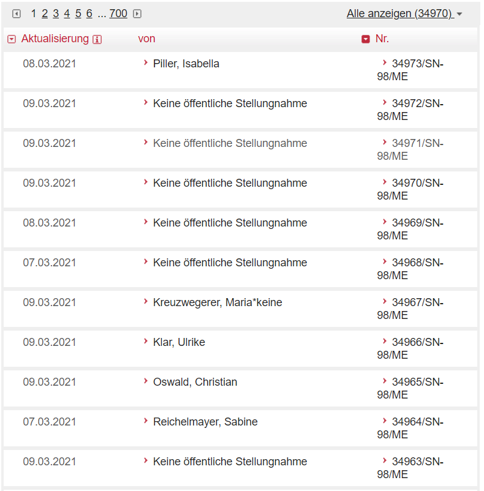

```{r setup, include=FALSE, code_collapse=NULL}
library(tidyverse)
library(svglite)
library(hrbrthemes)

knitr::opts_chunk$set(echo = FALSE)

plot_bg_color <- readr::read_file(file=here::here("theme.css")) %>% 
  str_extract(., regex("(?<=blog-bg-color:).*?(?=;)")) %>%
  str_trim() %>% 
  str_extract(., regex("^#\\S+"))


theme_post <- function() {
  hrbrthemes::theme_ipsum_rc(base_family="RobotoCondensed") +
    theme(
      plot.background = element_rect(fill = plot_bg_color, color=NA),
      panel.background = element_rect(fill = plot_bg_color, color=NA),
      plot.margin = margin(l = 0, 
                           t = 0.25,
                           unit = "cm"),
      plot.title = element_text(
        color = "grey20",
        face = "bold",
        margin = margin(l = 0, unit = "cm"),
        size = 13
      ),
      plot.title.position = "plot",
      plot.subtitle = element_text(
        color = "grey50",
        margin = margin(t = 0.2, b = 0.3, unit = "cm"),
        size = 11
      ),
      plot.caption = element_text(
        color = "grey50",
        size = 8,
        hjust = c(0)
      ),
      plot.caption.position = "panel",
      axis.title.x = element_text(
        angle = 0,
        color = "grey50",
        hjust = 1
      ),
      axis.text.x = element_text(
        size = 9,
        color = "grey50"
      ),
      axis.title.y = element_blank(),
      axis.text.y = element_text(
        size = 9,
        color = "grey50"
      ),
      panel.grid.minor.x = element_blank(),
      panel.grid.major.x = element_blank(),
      panel.grid.minor.y = element_blank(),
      panel.spacing = unit(0.25, "cm"),
      panel.spacing.y = unit(0.25, "cm"),
      strip.text = element_text(
        angle = 0,
        size = 9,
        vjust = 1,
        face = "bold"
      ),
      legend.title = element_text(
        color = "grey30",
        face = "bold",
        vjust = 1,
        size = 9
      ),
      legend.text = element_text(
        size = 9,
        color = "grey30"
      ),
      legend.justification = "left",
      legend.box = "horizontal", # arrangement of multiple legends
      legend.direction = "vertical",
      legend.margin = margin(l = 0, t = 0, unit = "cm"),
      legend.spacing.y = unit(0.07, units = "cm"),
      legend.text.align = 0,
      legend.box.just = "top",
      legend.key.height = unit(0.2, "line"),
      legend.key.width = unit(0.5, "line"),
      text = element_text(size = 5)
    )
}


```

# Context 

Here's yet another post (see [here](https://werk.statt.codes/post/2021-01-22-covidconsultationduration/){target="_blank"} and [here](https://werk.statt.codes/post/2020-12-22-submissionsepidemiclaw/){target="_blank"}) on public submissions to Covid-related bills as part of the public legislative consultation process in Austria (*Stellungnahmen im Begutachtungsverfahren*). 

Earlier this month, the government introduced another Covid related bill (98/ME XXVII), which triggered again a new record number of filed submissions. This numerical peak in the legislative arena was  paralleled by unprecedented hostile and partly violent demonstrations against the government. As in many countries, Covid demonstrations bring a colorful bunch of individuals to the street, including not only (if there is such a thing as) 'ordinary' citizens who may be exhausted and fearful for their e.g. economic future, but also right wing extremists (e.g. our former minister of interior), and other peculiar characters of highly dubious political shades. 

All in all, the unprecedented 'submission activism' and the significant turnout at the demonstrations are suggesting that the opposition to the government's Covid measures is far more than an aberration at the fringes or some freak cases. I think it's not an exaggeration to describe the public discourse as increasingly antagonistic and polarized, even if one acknowledges that submissions as part of a legislative consultative process or participating in a demonstration can be completely legitimate expressions of a democratic discourse.

# Submissions and non-disclosed authorship

However, with opposition to Covid measures increasingly visible, I was struck to notice that the text and authorship of many submissions related to 98/ME XXVII were not published on the parliament's website. The records just state 'Keine öffentliche Stellungnahme' (*No public statement*). While it's nothing unusual to have some submitters who prefer not to be named in public and hence choose the pertaining option when filing their submission, the frequency was remarkable when randomly scrolling through the list for the latest bill (see [here](https://www.parlament.gv.at/PAKT/VHG/XXVII/ME/ME_00098/index.shtml#tab-Stellungnahmen){target="_blank"}; to be clear, the parliament's relevant office has the names of the authors, they are just not published on the website). 

<aside>
```{r, echo=F, preview=F, code_folding=NULL}

```
</aside>

This made me wonder whether my observation was just based on an unrepresentative sample or the reflection of a wider pattern: **Are Covid-related bills featuring more submissions with not publicly disclosed authorship?**

This is just a blog post and not rigorously thought through, but I found the question particularly interesting since it reminded me of reports about right wing voters who either submit wrong or no answers at all when surveyed as to their voting intentions. Since their actual voting preference may be e.g. perceived as controversial, they prefer to keep it to themselves and do not answer truthfully. This is only a very crude description (see e.g. 'Shy Trump voters 2016', Bradley effect etc...), and I am not claiming that the same mechanism is actually at play in the Covid submission case, but I found the parallel intriguing enough to crunch the numbers. 

# Code

Unfold the snippet below to get the code for the analysis. I inserted comments where I thought they might be helpful.

```{r, eval=F, code_folding="Code: get overview of all bills"}
# packages ----------------------------------------------------------------
library(tidyverse)
library(rvest)
library(xml2)

# define a function which gives gives a list of all bills 

fn_get_bill_overview <- function(rss_feed) {
  df_rss <- xml2::read_xml(rss_feed)
  data <- xml_child(df_rss, 1)

  df_bill_pages_link <- data %>%
    xml2::xml_find_all("//link") %>%
    html_text() %>%
    enframe(.,
      name = "id",
      value = "link_single_bill_page"
    ) %>%
    mutate(link_single_bill_page = str_squish(link_single_bill_page)) %>%
    filter(id > 2) # removes first two rows which don't include data on bills

  # get title
  df_bill_pages_name <- data %>%
    xml2::xml_find_all("//title") %>%
    html_text() %>%
    enframe(.,
      name = "id",
      value = "title"
    ) %>%
    # mutate(name=str_extract(title, regex("(?<=\\>).*(?=\\<)"))) %>%
    mutate(title = str_trim(title)) %>%
    filter(id > 2)

  # get publication date
  df_bill_pages_pub_date <- data %>%
    xml2::xml_find_all("//pubDate") %>%
    html_text() %>%
    enframe(.,
      name = "id",
      value = "date"
    ) %>%
    mutate(date = date %>% str_squish() %>% lubridate::dmy_hms(., tz = "Europe/Vienna"))

  # combine to one dataframe
  df_bill <- bind_cols(
    df_bill_pages_name,
    df_bill_pages_pub_date,
    df_bill_pages_link,
  ) %>%
    select(-contains("id"))

  df_bill %>%
    mutate(legis_period=str_extract(link_single_bill_page, regex("(?<=VHG\\/).*(?=\\/ME\\/)")), .before=1) %>% 
    mutate(indicator_me_numeric = str_extract(link_single_bill_page, regex("(?<=_)\\d*"))) %>%
    mutate(indicator_me = glue::glue("{as.numeric(indicator_me_numeric)}/ME")) %>%
    mutate(link_single_bill_submissions=glue::glue("{link_single_bill_page}#tab-Stellungnahmen")) %>% 
    mutate(rss_single_bill_submissions = glue::glue("https://www.parlament.gv.at/PAKT/VHG/{legis_period}/ME/ME_{indicator_me_numeric}/filter.psp?view=RSS&jsMode=&xdocumentUri=&filterJq=&view=&GP={legis_period}&ITYP=ME&INR={as.numeric(indicator_me_numeric)}&SUCH=&listeId=142&FBEZ=FP_142
")) %>% 
    relocate(link_single_bill_page, .before="link_single_bill_submissions")
}

# create a vector with links to the rss feed of the bills of the different legislative periods (in roman numbers) 

periods <- as.roman(seq(14, 27, 1)) 
rss_bills_overview <- glue::glue("https://www.parlament.gv.at/PAKT/MESN/filter.psp?view=RSS&jsMode=&xdocumentUri=&filterJq=&view=&GP={periods}&MESN=ME&R_MESN=ME&MIN=ALLE&SUCH=&listeId=102&FBEZ=FP_002")

# apply the function
df_bills_all <- rss_bills_overview %>%
  purrr::set_names() %>%
  map_dfr(., fn_get_bill_overview, .id = "rss_bills_overview") %>% 
  arrange(date) %>% 
  distinct() #some duplicates
```


```{r, eval=F, code_folding="Code: get data and analyze", include=F}
# some tests

#some links are duplicates; remove
test_rss <- df_bills_all %>% 
  group_by(link_single_bill_page) %>% 
  mutate(n_rss_links=n())

df_bills_all %>% 
  group_by(legis_period) %>% 
  summarise(n_obs=n()) %>% 
  mutate(legis_period_num=as.roman(legis_period) %>% as.integer()) %>% 
  arrange(legis_period_num)

# readr::write_csv2(df_bills_all, file = here::here(
#   "_blog_data",
#   "2021_3_covid_authorship",
#   glue::glue("{Sys.Date()}-all_bills.csv")
# ))
```


```{r, eval=F, code_folding="Code: get data on submissions for all bills"}
# define function extracting list of submissions for a single bill

fn_get_submission_details <- function(link) {
  
  data <- xml2::read_xml(link)

  # get link to subpages with link to submissions
  df_submission_pages_link <- data %>%
    xml2::xml_find_all("//link") %>%
    html_text() %>%
    enframe(.,
      name = "id",
      value = "link_single_submission_page"
    ) %>%
    mutate(link_single_submission_page = str_squish(link_single_submission_page)) %>%
    filter(id > 2) # removes first two rows which don't include data on submissions

  # get title
  df_submission_pages_name <- data %>%
    xml2::xml_find_all("//title") %>%
    html_text() %>%
    enframe(.,
      name = "id",
      value = "title"
    ) %>%
    mutate(name = str_extract(title, regex("(?<=\\>).*(?=\\<)"))) %>%
    filter(id > 2) %>%
    select(-title)

  # get publication date
  df_submission_pages_pub_date <- data %>%
    xml2::xml_find_all("//pubDate") %>%
    html_text() %>%
    enframe(.,
      name = "id",
      value = "date"
    ) %>%
    mutate(date = date %>% str_squish() )#%>% lubridate::dmy_hms(., tz = "Europe/Vienna"))

  # combine to one dataframe
  df_submission <- bind_cols(
    df_submission_pages_name,
    df_submission_pages_pub_date,
    df_submission_pages_link,
  ) %>%
    select(-contains("id"))

  # if(nrow(df_submission)==0) {
  #   
  #   df_submission <- tibble(name=NA_character_, 
  #                           date=NA_character_, 
  #                           link_single_submission_page=NA_character_)
  # }
  
  df_submission
}

tbl_missing <- tibble(name=NA_character_, 
                      date=NA_character_, 
                      link_single_submission_page=NA_character_)

# apply function
df_all_submissions <- df_bills_all$rss_single_bill_submissions %>% 
  purrr::set_names() %>% 
  map_dfr(., possibly(fn_get_submission_details,
                      otherwise = tbl_missing),
          .id="rss_single_bill_submissions")
```


```{r, eval=F, code_folding="Code: get data and analyze", include=F}
# > test ------------------------------------------------------------------
length(unique(df_all_submissions$rss_single_bill_submissions)) #3769; 31 missing

df_missing_bills_submissions <- df_bills_all %>% 
#  select(rss_single_bill_submissions) %>% 
  filter(!rss_single_bill_submissions %in% unique(df_all_submissions$rss_single_bill_submissions))
nrow(df_missing_bills_submissions)
#function doesn't trigger error in these cases; if to be included
#include if clause on nrow==0

df_test <- df_missing_bills_submissions$rss_single_bill_submissions %>% 
  purrr::set_names() %>% 
  map_dfr(., fn_get_submission_details, .id="rss_single_bill_submissions")


# > save ------------------------------------------------------------------


write_csv2(df_all_submissions, 
           file=here::here("_blog_data",
                           "2021_3_covid_authorship",
                           "df_all_submissions.csv"))


# load data ---------------------------------------------------------------

# df_bills_all <- readr::read_csv2(file=here::here("data", "2021-03-10-all_bills.csv"))
# df_all_submissions <- readr::read_csv2(file=here::here("data", "df_all_submissions.csv"))
# head(df_all_submissions$rss_single_bill_submissions)
```


```{r, eval=F, code_folding="Code: analysis", include=T}
df_bill_submissions <- df_bills_all %>% 
  left_join(., df_all_submissions %>% 
              rename(date_submission=date),
            by="rss_single_bill_submissions") %>% 
  mutate(covid_bill=str_detect(title, regex("Covid|Epidemie", ignore_case = T))) %>% 
  mutate(public_author=!str_detect(name, regex("Keine öffentliche Stellungnahme"))) %>% 
  mutate(bill_id=glue::glue("{legis_period}-{indicator_me}"))

df_submissions_per_bill <- df_bill_submissions%>% 
  group_by(bill_id, date, title, covid_bill, public_author) %>% 
  summarise(submissions_n=n()) %>% 
  pivot_wider(., id_cols=c(bill_id, date, title, covid_bill),
              names_from=public_author,
              names_glue="public_author_{public_author}",
              values_from=submissions_n,
              values_fill = 0) %>% 
  mutate(submissions_total=public_author_TRUE+public_author_FALSE) %>% 
  mutate(non_public_author_share=public_author_FALSE/submissions_total)

# write_csv2(df_submissions_per_bill, file=here::here("_blog_data",
#                                                     "2021_3_covid_authorship",
#                                                     "df_submissions_per_bill.csv"))
```


```{r, eval=T, include=F}
df_submissions_per_bill <- readr::read_csv2(file=here::here("_blog_data",
                                                            "2021_3_covid_authorship",
                                                            "df_submissions_per_bill.csv"))
```


# Result

I guess the plot below speaks (hopefully) for itself: Those bills with Covid relation (in orange) not only feature much more filed submissions (size of the dots), they also feature much more submissions without the author and the text of the submission being publicly disclosed (location on the x-axis). The difference to submissions related to other bills is quite remarkable.

```{r, code_folding="Code: plot"}
library(ggiraph)
library(ggtext)

color_no <- "deepskyblue4"
color_yes <- "orange"

caption <- glue::glue("<span style='font-size:10pt; text-align: justify;
'>Seit September 2017 können alle, auch von einem Gesetzesvorschlag nicht unmittelbar betroffene Bürger<br>und Institutionen Stellungnahmen zu diesem im Rahmen des erweiterten Begutachtungsverfahrens (auch<br>online) einreichen. Es bleibt den Einreichenden überlassen, ob Name sowie Stellungnahme auf der Homepage<br>des Parlaments veröffentlicht wird. Die Graphik oben zeigt, dass der Anteil nicht-veröffentlichter Namen und<br>Stellungnahmen bei Einreichungen zur Begutachtung von Gesetzesvorschlägen mit COVID-Bezug außer-<br>gewöhnlich hoch war.</span><br><br>Data: https://www&#46;parlament&#46;gv&#46;at; {df_submissions_per_bill %>% 
  filter(date>as.Date('2017-09-01')) %>% nrow() %>% map_chr(., scales::label_comma())} Gesetzesvorschläge, {df_submissions_per_bill %>% filter(date>as.Date('2017-09-01')) %>% pull(submissions_total) %>% sum() %>% map_chr(., scales::label_comma())} Stellungnahmen. <br>Analysis: Roland Schmidt | @zoowalk | https://werk&#46;statt&#46;codes")

pl_public<- df_submissions_per_bill %>% 
  filter(date>as.Date("2017-09-01")) %>% #opening of consultation process to general public
  mutate(covid_bill_facet=case_when(covid_bill=="FALSE" ~ glue::glue("Stellungnahmen zu<br>Gesetzesvorschlägen <span style='color:{color_no}; font-size:12pt;'>ohne<br></span> COVID-Maßnahmen Bezug "),
                                    covid_bill=="TRUE" ~ glue::glue("Stellungnahmen zu<br>Gesetzesvorschlägen <span style='color:{color_yes}; font-size:12pt;'>mit<br></span> COVID-Maßnahmen Bezug"))) %>% 
  ggplot()+
  labs(y="Anteil nicht-veröffentlichter Stellungnahmen",
       x="Covid19 related bill",
       title=glue::glue("BEGUTACHTUNGSVERFAHREN: Anteil nicht-veröffentlichter Einreicher-Namen<br>bei Stellungnahmen zu Gesetzesvorschlägen <span style='color:{color_yes}'>mit</span> und <span style='color:{color_no}'>ohne</span> COVID-Maßnahmen<br>Bezug"),
   #    subtitle="",
       caption=caption)+
  geom_jitter_interactive(
    aes(
      x=covid_bill_facet,
      y=non_public_author_share,
      color=covid_bill,
      size=submissions_total,
      tooltip=glue::glue("{date}
                         {bill_id}
                         {title}
                         Submissions total: {submissions_total}
                         Submissions not public: {scales::percent(non_public_author_share)}
                         ")),
    width=0.3)+
  scale_y_continuous(labels = scales::label_percent(),
                     expand=expansion(mult=c(0,0.03)))+
  # scale_x_discrete(expand=expansion(mult=c(0.1,0)))+
  scale_color_manual(guide=NULL,
                       values=c("FALSE"=color_no, 
                                "TRUE"=color_yes))+
  scale_size_continuous(name="Anzahl Stellungnahmen gesamt:",
                        labels=scales::label_comma())+
  coord_flip()+
  theme_post()+
  theme(legend.direction = "horizontal",
        legend.position = c(1,1),
        legend.justification = c(1,0),
        legend.text = element_text(color="grey50"),
        legend.title = element_text(color="grey50",
                                    face = "plain",
                                    vjust=0.5),
        strip.text.y.left = element_markdown(hjust=.5,
                                             vjust=.5,
                                             angle = 0),
        strip.text = element_markdown(),
        axis.text.y = element_markdown(),
        plot.title = element_markdown(margin = margin(b=.5, unit="cm")),
        panel.grid.major.y = element_blank(),
        panel.grid.major.x = element_line(),
        plot.caption = element_markdown(),
        plot.caption.position = "plot")+
    guides(size=guide_legend(override.aes = list(color="grey50")))

```


```{r, echo=F, code_folding=NULL, dev="svglite"}
girafe(ggobj = pl_public,
       height_svg = 4.5,
       font=list(sans="RobotoCondensed"),
       options = list(
    opts_toolbar(saveaspng = FALSE),
    opts_tooltip(css = glue::glue("background-color:{plot_bg_color}; 
                 line-height:100%;
                 color:black;
                 font-size:80%;
                 font-family:'Roboto Condensed';)"))
  ))
```

