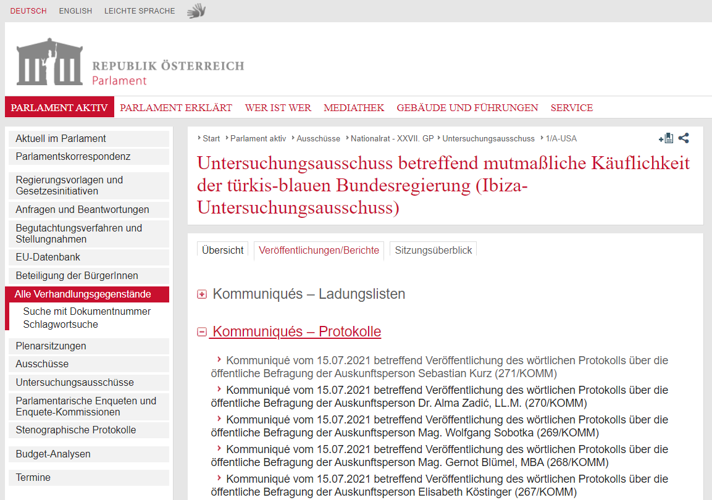

# Context

In mid-June, the Austrian Parliament's *'Commission of Inquiry concerning the alleged corruptibility of the turquois-blue Federal Government'*[^1] heard its last respondent (*'Auskunftsperson'*). More informally, the commission is simply called 'Ibiza inquiry', named after the location of a secretly taped video which showed high ranking members of the extreme right FPÖ party speaking freely - liberated by alcohol - with a fake niece of a Russian oligarch about actual or intended corruption in Austria's political system. As a consequence of the video's release, the then ruling coalition government of ÖVP ('turquoise') and FPÖ ('blue') collapsed and the commission was set up. In short, a pretty wild and bewildering story.

[^1]: ['Untersuchungsausschuss betreffend mutmaßlicher Käuflichkeit der türkis-blauen Bundesregierung'](https://www.parlament.gv.at/PAKT/VHG/XXVII/A-USA/A-USA_00002_00906/index.shtml){target="_blank"}

The commission, empowered with a fairly broad mandate and armed with access to plenty of WhatsApp etc messages, offered an unprecedented view into the inner-working of Chancellor Kurz's first government and the mindset of some of its protagonists. While the initial impetus for setting up the commission was first and foremost the Ibiza video featuring the FPÖ leadership, the inquiry's focus gradually shifted (not least due to the opposition's efforts) to the wheeling and dealing of Chancellor Sebastian Kurz's ÖVP and its affiliates.

Having said this, the purpose of this post is not to give a recap of the inquiry or its results, but first and foremost procedural in the sense that it intends to detail the necessary steps to extract statements from the inquiry's transcripts and subsequently obtain some exemplary insights with R. As always, if you spot any error, feel free to contact me, best via [twitter DM](https://twitter.com/zoowalk){target="_blank"}. And if you use any of the work provided here, grateful if you acknowledge my input.

If you are not interested in any of the coding steps generating the data, jump directly to the [Analysis] section which still contains plenty of code, but you're not burdened with how to obtain the data in the first place.

# Getting the data

In this section I will layout the necessary steps to obtain the relevant data. I'll first detail each step with one single, sample session of the inquiry commission. Subsequently, I'll apply the demonstrated steps to all sessions by means of one general function.

But before, let's load the packages we'll need along the way and define some templates.

```{r, code_folding=F}
# libraries ---------------------------------------------------------------
#load the required libraries
library(tidyverse)
library(rvest)
library(xml2)
library(fuzzyjoin)
library(reactable)
library(reactablefmtr)
library(hrbrthemes)


#define party colors
vec_party_col <- c(
  "ÖVP"="#5DC2CC",
  "SPÖ"="#FC0204", 
  "Grüne"="#A3C630",
  "FPÖ"="#005DA8", 
  "NEOS"="#EA5290"
  ) 
```

```{r, include=F}
# theme for reactables
options(reactable.theme=reactableTheme(
  style=list(fontSize="12px",
             lineHeight="14px",
             fontFamily="Roboto condensed",
             compact=T,
             bordered = T,
             highlight = T)))


plot_bg_color <- readr::read_file(file=here::here("theme.css")) %>% 
  str_extract(., regex("(?<=blog-bg-color:).*?(?=;)")) %>%
  str_trim() %>% 
  str_extract(., regex("^#\\S+"))

#ggplot theme
theme_post <- function() {
  hrbrthemes::theme_ipsum_rc() +
    theme(
      plot.background = element_rect(fill = plot_bg_color, color=NA),
      panel.background = element_rect(fill = plot_bg_color, color=NA),
      plot.margin = margin(l = 0, 
                           t = 0.25,
                           unit = "cm"),
      plot.title = element_text(
        color = "grey20",
        face = "bold",
        margin = margin(l = 0, unit = "cm"),
        size = 13
      ),
      plot.title.position = "plot",
      plot.subtitle = element_text(
        color = "grey50",
        margin = margin(t = 0.2, b = 0.3, unit = "cm"),
        size = 11
      ),
      plot.caption = element_text(
        color = "grey50",
        size = 8,
        hjust = c(0)
      ),
      plot.caption.position = "panel",
      axis.title.x = element_text(
        angle = 0,
        color = "grey50",
        hjust = 1
      ),
      axis.text.x = element_text(
        size = 9,
        color = "grey50"
      ),
      axis.title.y = element_blank(),
      axis.text.y = element_text(
        size = 9,
        color = "grey50"
      ),
      panel.grid.minor.x = element_blank(),
      panel.grid.major.x = element_blank(),
      panel.grid.minor.y = element_blank(),
      panel.spacing = unit(0.25, "cm"),
      panel.spacing.y = unit(0.25, "cm"),
      strip.text = element_text(
        angle = 0,
        size = 9,
        vjust = 1,
        face = "bold"
      ),
      legend.title = element_text(
        color = "grey30",
        face = "bold",
        vjust = 1,
        size = 9
      ),
      legend.text = element_text(
        size = 9,
        color = "grey30"
      ),
      legend.justification = "left",
      legend.box = "horizontal", # arrangement of multiple legends
      legend.direction = "vertical",
      legend.margin = margin(l = 0, t = 0, unit = "cm"),
      legend.spacing.y = unit(0.07, units = "cm"),
      legend.text.align = 0,
      legend.box.just = "top",
      legend.key.height = unit(0.2, "line"),
      legend.key.width = unit(0.5, "line"),
      text = element_text(size = 5)
    )
}


```

## Getting links to transcripts

In a first step, let's get the links leading to the transcripts of the sessions. This [link](https://www.parlament.gv.at/PAKT/VHG/XXVII/A-USA/A-USA_00002_00906/index.shtml#tab-VeroeffentlichungenBerichte){target="_blank"} leads us to the commission's overview page including all published reports, including the sessions' transcripts (*Protokolle*).



The code below extracts links related to the latter. Explanatory comments are inserted directly into the code chunk.

```{r, cache=F, cache.extra=Sys.Date(), code_folding=F}
#link to overview page
site_link <- "https://www.parlament.gv.at/PAKT/VHG/XXVII/A-USA/A-USA_00002_00906/index.shtml#tab-VeroeffentlichungenBerichte"

# get links to pages where links to protocols are located
# link has to include words 'Protokolls' in text;
df_links_to_subpages <- site_link %>%
  rvest::read_html() %>%
  #define a filter to get only the links related to transcripts (protocols)
  # filters links based on text/name of links
  rvest::html_elements(xpath = "//a[contains(text(), 'Protokolls')]") %>%
  html_attr("href") %>%
  # extracts links
  enframe(name = NULL, value = "link") %>%
  #links of interest inlude "KOMM"
  filter(str_detect(link, regex("KOMM"))) %>%
  #complete the link
  mutate(link_to_subpages = paste0("https://www.parlament.gv.at/", link)) %>%
  select(link_to_subpages)
```

Here the first ten links:

```{r, code_folding=NULL, echo=F}
head(df_links_to_subpages, n=10) %>% 
  reactable()
```

Each of these links leads to a subpage which provides details on the record in question and the link to the actual file containing the transcribed text. Below one such [subpage](https://www.parlament.gv.at//PAKT/VHG/XXVII/KOMM/KOMM_00271/index.shtml){target="_blank"}.


Note the link leading to the HTML version of the transcript. To access the transcript we need the link's target address. The function below extracts the link leading to actual text. Subsequently, the function is applied to all subpage links which we obtained in the previous step.

```{r, code_folding=F}
# function to extract link to protocol from details page

fn_get_link_to_record <- function(link_to_subpage) {
  link_to_subpage %>%
    rvest::read_html() %>%
    rvest::html_elements("a") %>%
    html_attr("href") %>%
    enframe(
      name = NULL,
      value = "link"
    ) %>%
    #link to transcript contains "fnameorig"
    filter(str_detect(link, regex("fnameorig"))) %>%
    #complete link
    mutate(link_to_record = paste0("https://www.parlament.gv.at/", link)) %>%
    select(link_to_record)
}

library(furrr)
plan(multisession, workers = 2)


# apply function to all links
df_links_to_records <- df_links_to_subpages %>%
  pull(link_to_subpages) %>%
  purrr::set_names() %>%
  future_map_dfr(., fn_get_link_to_record, .id = "link_to_subpages")

```

What we obtain is a dataframe including the links which lead to *all* transcripts of the inquiry (only first 5 are shown).

```{r, echo=F, code_folding=NULL}
reactable::reactable(df_links_to_records %>% 
                       slice_head(., n=5))
```

## Extracting text

Now with the links to the transcripts available, let's have a look at one such text, e.g. [here](https://www.parlament.gv.at/PAKT/VHG/XXVII/KOMM/KOMM_00271/fnameorig_990146.html){target="_blank"}.

{width="2703"}

Importantly, notice that statements given before the inquiry commission are always introduced with the *speaker's name (and position) in bold and underlined letters*. This (almost) consistently applied formatting will eventually allow us to distinguish between the actual statement and its speaker, and the start/end of different statements. I'll first extract these names and subsequently assign these names to their respective statements.

### Extract speakers

```{r, include=F}
    link_to_record <- "https://www.parlament.gv.at//PAKT/VHG/XXVII/KOMM/KOMM_00271/fnameorig_990146.html"

#test link
  # link_to_record <- "https://www.parlament.gv.at/PAKT/VHG/XXVII/KOMM/KOMM_00271/fnameorig_990146.html"


```

To extract the speakers from the text I'll use once again the powerfull `rvest` package. To identify those text parts which are in bold and underlined, its `html_elements` function is used. As for the resort to `xml_contents` I am grateful for the answer to [this](https://stackoverflow.com/questions/38195120/how-can-i-retain-format-in-a-page-webscraped-with-rvest/38195693){target="_blank"} Stackoverflow question.

```{r, cache=F, cache.extra=Sys.Date(), code_folding=F, eval=T}
# get those elements which are bold and underlined
df_speakers <- link_to_record %>%
    rvest::read_html() %>%
    #extract elements which are bold and underlined; note that the sequence has to be that of the html tags 
    rvest::html_elements("b u") %>%
    map(., xml_contents) %>%
    map(., html_text) %>%
    enframe(value = "speaker") %>%
    mutate(speaker = str_trim(speaker, side = c("both"))) %>%
    mutate(speaker = str_squish(speaker)) %>%
    # keep only those elements which end with colon;
    # filter(str_detect(speaker, regex("\\:$"))) %>%
    #remove colon at end; needed to unify names of speakers where some instances end/do not end with colon
    mutate(speaker=str_remove(speaker, regex("\\:$"))) %>% 
    filter(str_count(speaker, regex("\\S+"))>1) %>% 
    #removes heading of transcript which is also bold and underlined
    filter(!str_detect(speaker, regex("^Befragung der"))) %>% 
    distinct(speaker)
```

Here's the result for our one our sample session.

```{r, echo=F, code_folding=NULL}
df_speakers
```

As you can see, the approach worked rather well, but not 100 % perfect. There are a few rows which contain incomplete names of speakers or some related fragments (Sobotka without a). These unwanted results are - as far as I can tell - due to some inconsistent formatting of speakers' names (even if their appearance in the document is identical) or editorial errors (e.g. the position of a speaker is mentioned in one instance, but not in another, e.g. Abgeordneter mag. Klaus Führlinger). These glitches have to be corrected 'manually'. The code chunk below does this for our specific sample case.

```{r, cache=F, cache.extra=Sys.Date(), code_folding=F, eval=T, include=F}
# introduce corrections to errors in transcript for one test link; not published link
  df_speakers <- df_speakers %>%
    #remove fragments; speaker has to comprise at least two words
    filter(str_count(speaker, regex("\\S+"))>1) %>% 
    mutate(speaker = case_when(
      str_detect(speaker, regex("Fürlinger")) ~ "Abgeordneter Mag. Klaus Fürlinger (ÖVP):",
      str_detect(speaker, regex("^Nina Tomaselli")) ~ "Abgeordnete Mag. Nina Tomaselli (Grüne):",
      str_detect(speaker, regex("Hanger")) ~ "Abgeordneter Mag. Andreas Hanger (ÖVP):",
      str_detect(speaker, regex("Gödl")) ~ "Abgeordneter Mag. Erst Gödl (ÖVP):",
      TRUE ~ as.character(speaker))) %>%
    # remove colon at end; some are with, some without
    mutate(speaker = str_remove(speaker, regex("\\:$"))) %>%
    distinct(speaker)

#correction: remove entries where names of deputies were extracted twice since
#party membership was missing in at least one instance
df_speaker <- df_speakers %>% 
  filter(!str_detect(speaker, regex("^Abge.*[^\\)]$")))
  
```

```{r, cache=F, cache.extra=Sys.Date(), code_folding=F, eval=T, include=F}
# introduce corrections to errors in transcript
  df_speakers <- df_speakers %>%
    #remove fragments; speaker has to comprise at least two words
    filter(str_count(speaker, regex("\\S+"))>1) %>% 
    mutate(speaker = case_when(
      str_detect(speaker, regex("Fürlinger")) ~ "Abgeordneter Mag. Klaus Fürlinger (ÖVP):",
      str_detect(speaker, regex("^Vorsitzender Mag\\. Wolfgang Sobot")) ~ "Vorsitzender Mag. Wolfgang Sobotka:",
      TRUE ~ as.character(speaker))) %>%
    # remove colon at end; some are with, some without
    mutate(speaker = str_remove(speaker, regex("\\:$"))) %>%
    distinct(speaker)

#correction: remove entries where names of deputies were extracted twice since
#party membership was missing in at least one instance
df_speakers <- df_speakers %>% 
  filter(!str_detect(speaker, regex("^Abge.*[^\\)]$")))
  
```

After these modifications we get a clean dataframe of those who made statements during the session in question (our sample link).

```{r, echo=F, code_folding=NULL}
df_speakers
```

In a later step, we will search the entire transcript of the session for the presence of these speakers' names (incl. position and title) to identify the start of a statement. Since this pattern matching will require regular expressions (*regex*), the names have to be modified accordingly (e.g. a dot . has to be escaped and becomes `\\.`, for further info see [here](https://stringr.tidyverse.org/articles/regular-expressions.html#escaping-1){target="_blank"}).

```{r, cache=F, cache.extra=Sys.Date(), code_folding=F, eval=T}
# create regex
  df_speakers <- df_speakers %>%
    mutate(
      speaker_pattern =
        str_replace_all(speaker, "\\.", "\\\\.") %>%
          str_replace_all(., "\\:", "\\\\:") %>%
          # str_replace_all(., "\\,", "\\\\,") %>%
          str_replace_all(., "\\)", "\\\\)") %>%
          str_replace_all(., "\\(", "\\\\(") %>% 
        #match has to be at start of string; avoids mismatches where name appears in middle of text
        paste0("^",.))
```

### Identify and extract statements

Now, let's get the entire text of a transcript. Again, I use the `rvest` package, this time, however, the hmtl-tag `<p>` is targeted.

```{r, cache=F, cache.extra=Sys.Date(), code_folding=F, eval=T, include=T}
## Extract entire text from transcript

df_text <- link_to_record %>%
    rvest::read_html() %>%
    rvest::html_elements("p") %>%
    rvest::html_text() %>%
    enframe(., 
            value = "text",
            name="row") %>%
    mutate(text = str_squish(text) %>%
      str_trim(., side = c("both")))
```

```{r, paged.print=TRUE, echo=F, code_folding=NULL}
df_text %>% reactable::reactable(.,
                                 columns = list(
                                   row=colDef(width=50),
                                   text=colDef(width = 600)))
```

The result is a dataframe with one row for each line in the transcript. The challenge is now to identify those rows where a speaker's statement starts and ends/the next speaker's statement begins. I'll do this by - as already mentioned above - pattern matching the names of the retrieved speakers with the content of each row. In simpler terms, does the row start with the name of a speaker which we previously identified by their bold and underlined format? To do this I'll make use of `fuzzyjoins::regex_left_join`.

```{r, cache=F, cache.extra=Sys.Date(), code_folding=F, eval=T, include=T}
# get speaker name from text
  df_text_2 <- df_text %>%
    #search for match only in opening section of line
  #  mutate(text_start=stringr::str_sub(text, start=1, end=40)) %>% 
    fuzzyjoin::regex_left_join(.,
      df_speakers,
      by = c("text" = "speaker_pattern")
    ) # speaker_pattern
```

```{r, include=F}
dupes <- df_text_2 %>% 
  count(row, sort=T) %>% 
  filter(n>1) 

df_dupes <- df_text_2 %>% 
  semi_join(.,
            dupes) %>% 
  reactable()
  
    
```

Have a look at the result below. There's now a new column *indicating the start of a statement* with the speaker's name (since transcripts are starting with some introductory text you'll see speakers' names appear only on later pages in the table).

```{r, echo=F, code_folding=NULL}
df_text_2 %>% 
  select(contains("speaker"), everything()) %>% 
  reactable::reactable(.,
                       columns = list(
                                   row=colDef(width=50),
                                   text=colDef(width = 600)),
                       filterable = T)
```

In the next step, I 1) `dplyr::fill` all empty speaker rows after a statement's start with the speaker's name (details [here](https://tidyr.tidyverse.org/reference/fill.html){target="_blank"}), and 2) create a numerical grouping variable which increases each time the speaker is changing (= start of new statement). Remaining rows without a speaker are removed since they contain only additional text and not statements.

```{r, cache=F, cache.extra=Sys.Date(), code_folding=F, eval=T, include=T}
df_text_2 <- df_text_2 %>%
    # fill rows with speaker and pattern as basis for grouping
    fill(speaker, .direction = "down") %>%
    fill(speaker_pattern, .direction = "down") %>%
    filter(!is.na(speaker)) %>%
    # create grouping id; later needed to collapse rows
    mutate(grouping_id = ifelse(speaker == dplyr::lag(speaker, default = "start"),
      0,
      1
    )) %>%
    mutate(grouping_id_cum = cumsum(grouping_id)) %>%
    # remove speaker info from actual spoken text
    mutate(text = str_remove(text, speaker_pattern)) %>%
    # remove colon; this approach keeps annotations which are included between speaker name and colon; e.g "(zur Geschäftsbehandlung)";
    mutate(text = str_remove(text, regex("\\:"))) %>%
    mutate(text = str_trim(text, side = c("both")))
```

```{r, echo=F, code_folding=NULL}
df_text_2 %>% 
   select(contains("grouping"), 
          contains("speaker"), 
          everything()) %>% 
  reactable::reactable(.,
                                 columns = list(
                                   row=colDef(width=50),
                                   text=colDef(width = 600))) 
```

With each row now attributed to a speaker, and each statement assigned with a distinct indicator, we can collapse a statement's multiple lines into one single row with its single speaker.

```{r, cache=F, cache.extra=Sys.Date(), code_folding=F, eval=T, include=T}
df_text_3 <- df_text_2 %>%
    # collapse rows
    group_by(grouping_id_cum) %>%
    summarise(
      text = paste(text, collapse = " "),
      speaker = unique(speaker)
    ) %>%
    relocate(speaker, .before = "text") %>%
    mutate(text = str_trim(text, side = c("both")))
```

```{r, echo=F, code_folding=NULL}
df_text_3 %>% 
   select(contains("grouping"), 
          contains("speaker"), 
          everything()) %>% 
  reactable::reactable(.,
                                 columns = list(
                                   text=colDef(width = 600)))
```

The resulting table already represents most of the required data for the later analysis (for one specific sample respondent). I complement it with additional data on an MP's party affiliation (if applicable); a speaker's position (if stated); and the session's date, duration and number.

```{r, cache=F, cache.extra=Sys.Date(), code_folding=F, eval=T, include=T}
df_text_3 <- df_text_3 %>%
    # extract party of MP; pattern matches only if speaker starts with Abgeordneter
    mutate(speaker_party=str_extract(speaker, regex("(?<=^Abgeordnete[^\\(]{1,40})\\(.*\\)$"))) %>% 
    mutate(speaker_party=str_extract(speaker_party, regex("[:alpha:]+"))) %>% 
  # extract position of speaker
    mutate(speaker_position = case_when(
      str_detect(speaker, regex("^Abgeord")) ~ "Abgeordneter",
      str_detect(speaker, regex("^Verfahrensanwalt")) ~ "Verfahrensanwalt",
      str_detect(speaker, regex("^Vorsitzender-Stellvertreter")) ~ "Vorsitzender-Stellvertreter",
      str_detect(speaker, regex("^Vorsitzende")) ~ "Vorsitzende/r",
      str_detect(speaker, regex("^Verfahrensrichter-Stellvertreter")) ~ "Verfahrensrichter-Stellvertreter",
      str_detect(speaker, regex("^Verfahrensricht")) ~ "Verfahrensrichter",
      str_detect(speaker, regex("^Vertrauensperson")) ~ "Vertrauensperson",
      TRUE ~ as.character("Auskunftsperson")
    ))

```

```{r, cache=F, cache.extra=Sys.Date(), code_folding=F, eval=T, include=T}
# add session details
# extract date of session
  vec_respondent <- df_text %>%
    filter(str_detect(text, regex("^Befragung der Auskunftsperson"))) %>%
    pull(text) %>%
    str_remove(., "^Befragung der Auskunftsperson ")

  # extract duration of ENTIRE session (not only respondent)
  vec_duration <- df_text %>%
    filter(str_detect(text, regex("^Gesamtdauer der"))) %>%
    pull(text) %>%
    str_extract(., regex("(?<=Sitzung).*"))

  # extract session number
  vec_session_no <- df_text %>%
    filter(str_detect(text, regex("^Gesamtdauer der"))) %>%
    pull(text) %>%
    str_extract(., regex("\\d*(?=\\. Sitzung)"))

  # extract date of session
  vec_date <- df_text %>%
    filter(str_detect(text, regex("^Montag|^Dienstag|^Mittwoch|^Donnerstag|^Freitag|^Samstag|^Sonntag"))) %>%
    pull(text)

df_text_4 <- df_text_3 %>%
    mutate(
      session_date = vec_date,
      session_no = vec_session_no,
      session_duration = vec_duration,
      respondent = vec_respondent
    ) %>%
    select(session_no, session_date, session_duration, respondent, speaker, speaker_position, speaker_party, text, -grouping_id_cum)
```

### Party affiliation of MP asking question(s)

A further detail which we can extract is the party affiliation of an MP who asks a question of the respondent. In other words, each row from a respondent obtains an column indicating the party of the MP who asked the question. To do so, however, implies the assumption that any row/statement by an MP which precedes a row/statement by the respondent is actually a question by the MP. This assumption may not always be warranted. In some cases statements/rows by both an MP and a respondent may e.g. actually refer to an earlier question by the commission's chair and hence not be an interaction between the latter two.

Bearing this qualification in mind, the approach seems promising enough to identify interactions between an MP and a respondent and consider the former's party affiliation.

```{r, cache=F, cache.extra=Sys.Date(), code_folding=F, eval=T, include=T}
# identify party
  df_text_4 <- df_text_4 %>%
    mutate(respondent_questioner_party = case_when(
      str_detect(lag(speaker_position), regex("^Abge")) &
        speaker_position=="Auskunftsperson" ~ lag(speaker_party),
      TRUE ~ NA_character_)) %>%
  # calculate answer length without annotations included in transcripts
    mutate(text_length_old=stringi::stri_count_words(text, locale="de")) %>% 
    mutate(text_length = str_remove_all(text, regex("\\([^\\(\\)]*\\)")) %>% 
             stringi::stri_count_words(., locale="de"))
```

```{r, echo=F, code_folding=NULL}
df_text_4 %>% 
   select(contains("grouping"), 
          contains("speaker"), 
          everything()) %>% 
  mutate(text=str_trunc(text, width = 300, side = "right")) %>% 
  reactable::reactable(., columns = list(
                                   text=colDef(width = 600)))
```

### Function for all sessions

The example above detailed the code and results for only one sample respondent to illustrate each individual step. In the chunk below, I wrap all implemented steps into a function which is subsequently applied to every single link leading to a transcript text. Unfold the code chunk to below to see the entire function.

```{r, cache=F, cache.extra=Sys.Date(), code_folding=T, eval=T}
# Extract data - Function -------------------------------------------------

link_to_record <- "https://www.parlament.gv.at//PAKT/VHG/XXVII/KOMM/KOMM_00271/fnameorig_990146.html"

fn_get_data <- function(link_to_record) {

  # get those elements which are bold and underlined
  df_speakers <- link_to_record %>%
    rvest::read_html() %>%
    rvest::html_elements("b u") %>%
    map(., xml_contents) %>%
    map(., html_text) %>%
    enframe(value = "speaker") %>%
    mutate(speaker = str_trim(speaker, side = c("both"))) %>%
    mutate(speaker = str_squish(speaker)) %>%
    #remove colon at end; needed to unify names of speakers where some instances end/do not end with colon
     mutate(speaker=str_remove(speaker, regex("\\:$"))) %>% 
     #remove fragments shorter than 2 words
     filter(str_count(speaker, regex("\\S+"))>1) %>% 
     #removes heading of transcript which is also bold and underlined
     filter(!str_detect(speaker, regex("^Befragung der"))) %>% 
     distinct(speaker)
    
  #remove fragmensts of deputy names: starts with Abgeordnete but doesn't end with last
  #parenthesis enclosing party affiliation or colon
  df_speakers <- df_speakers %>%
    filter(!str_detect(speaker, regex("^Abge.*[^\\):]$")))

  # 'manually' introduce corrections to formatting/editorial errors in transcript
  df_speakers <- df_speakers %>%
    mutate(speaker=str_replace(speaker, "Wolfang", "Wolfgang")) %>% 
    mutate(speaker=str_replace(speaker, "Sobotk\\b", "Sobotka")) %>% 
    mutate(speaker = case_when(
      str_detect(speaker, regex("Stellvertreter Mag\\. Friedrich Ofenauer")) ~ "Vorsitzender-Stellvertreter Mag. Friedrich Ofenauer",
      #Ofenauer is not a MP participating in inquiry
      str_detect(speaker, regex("^Mag. Friedrich Ofenauer \\(ÖVP\\)")) ~ "Abgeordneter Mag. Friedrich Ofenauer (ÖVP):",
      str_detect(speaker, regex("^Abgeordneter Mag. Friedrich Ofenauer")) ~ "Abgeordneter Mag. Friedrich Ofenauer (ÖVP):",
      str_detect(speaker, regex("Nina Tomaselli")) ~ "Abgeordnete Mag. Nina Tomaselli (Grüne):",
      str_detect(speaker, regex("Gerstl")) ~ "Abgeordneter Mag. Wolfgang Gerstl (ÖVP)
:",
      str_detect(speaker, regex("Hanger")) &
        !str_detect(speaker, "Vorsitz") ~ "Abgeordneter Mag. Andreas Hanger (ÖVP):",
      str_detect(speaker, regex("Hanger")) &
        str_detect(speaker, "Vorsitzender-Stellvertreter") ~ "Vorsitzender-Stellvertreter Mag. Andreas Hanger:",

      str_detect(speaker, regex("^Andreas Holzer")) ~ "Mag. Andreas Holzer, MA:",
      # double check; Sobotka was Vorsitzender and respondent
      #? controls for typo in transcript (Wolfang, Lisa Wieser respondent)
      str_detect(speaker, regex("^Wolfg?ang Sobotka")) ~ "Vorsitzender Mag. Wolfgang Sobotka:",
      #str_detect(speaker, regex("^Mag\\. Wolfgang Sobotka")) ~ "Mag. Wolfgang Sobotka:",
      # str_detect(speaker, regex("^Vorsitzender Mag\\. Wolfgang Sobot")) ~ "Vorsitzender Mag. Wolfgang Sobotka:",
      str_detect(speaker, regex("^Hans-Peter Weiss")) ~ "Dipl.-Ing. Hans-Peter Weiss",
      str_detect(speaker, regex("^Bernhard Perner")) ~ "Dipl.-Ing. Bernhard Perner",
      str_detect(speaker, regex("^Dr\\. Martin Graf \\(FPÖ\\)")) ~ "Abgeordneter Mag. Dr. Martin Graf (FPÖ):",
      str_detect(speaker, regex("^Dr\\. Daniel Varro, LL\\.M\\.")) ~ "MMag. Dr. Daniel Varro, LL.M.",
      str_detect(speaker, regex("orsitzender-Vertreterin Doris Bures")) ~ "Vorsitzender-Vertreterin Doris Bures",
      str_detect(speaker, regex("Nikolaus Kern, akad.$")) ~ "Nikolaus Kern, akad. M&S (WU)",
      str_detect(speaker, regex("^M?ag\\. Wolfgang Gerstl \\(ÖVP\\)")) ~ "Abgeordneter Mag. Wolfgang Gerstl (ÖVP)",
      str_detect(speaker, regex("Krisper")) ~ "Abgeordnete Dr. Stephanie Krisper (NEOS):",
      str_detect(speaker, regex("Kai Jan")) ~ "Abgeordneter Kai Jan Krainer (SPÖ):",
      str_detect(speaker, regex("Fürlinger")) ~ "Abgeordneter Mag. Klaus Fürlinger (ÖVP):",
      str_detect(speaker, regex("Mag\\. Erich Leopold")) ~ "Mag. Erich Leopold, MSc:",
      str_detect(speaker, regex("Gödl")) ~ "Abgeordneter Mag. Ernst Gödl (ÖVP):",
      str_detect(speaker, regex("Hafenecker")) ~ "Abgeordneter Christian Hafenecker, MA (FPÖ)",
      str_detect(speaker, regex("Mag\\. Christina Jilek")) ~ "Mag. Christina Jilek, LL.M.",
      str_detect(speaker, regex("Verfahrensanwalt-Stellvertreterin Mag\\. Dr\\. Barbara Weiß, LL\\.")) ~ "Verfahrensanwalt-Stellvertreterin Mag. Dr. Barbara Weiß, LL.M.",
      TRUE ~ as.character(speaker)
    )) %>%
    # remove wrongly formatted part of Kern
    filter(!str_detect(speaker, regex("^M\\&S \\(WU\\)"))) %>%
    # remove instances where only position fragments were extracted; keeping them would
    #lead to dupes in the fuzzy joins since the complete 'version' is in any case
    #already included
    filter(!str_detect(speaker, regex("^Vorsitzender Mag\\.$"))) %>% 
    filter(!str_detect(speaker, regex("^Vorsitzender-Stellvertreter Mag\\.$"))) %>% 
    filter(!str_detect(speaker, regex("^Abgeordnete(r)? Mag\\.$"))) %>% 
    filter(!str_detect(speaker, regex("^Abgeordnete(r)? M$"))) %>% 
    # remove colon at end; some are with, some without
    mutate(speaker = str_remove(speaker, regex("\\:$"))) %>%
    distinct(speaker)

  # create regex
  df_speakers <- df_speakers %>%
    mutate(
      speaker_pattern =
        str_replace_all(speaker, "\\.", "\\\\.") %>%
          str_replace_all(., "\\:", "\\\\:") %>%
          # str_replace_all(., "\\,", "\\\\,") %>%
          str_replace_all(., "\\)", "\\\\)") %>%
          str_replace_all(., "\\(", "\\\\(") %>% 
        #match has to be at start of string; avoids mismatches where name appears in middle of text
        paste0("^",.))

  df_speakers <- df_speakers %>%
    # remove titles after comma
    mutate(speaker_name = str_remove(speaker, regex(",.*\\:"))) %>%
    # every word ending with a dot (= academic abbreviations)
    mutate(speaker_name = str_remove_all(speaker_name, regex("\\S*\\."))) %>%
    # remove first word = position
    mutate(speaker_name = str_remove(speaker_name, regex("^\\S*"))) %>%
    # remove colon at end of speaker name
    mutate(speaker_name = str_remove(speaker_name, regex("\\:"))) %>%
    mutate(speaker_name = str_trim(speaker_name, side = c("both")))
  
  
## Extract entire text
  
# extract full text from minutes
  df_text <- link_to_record %>%
    rvest::read_html() %>%
    rvest::html_elements("p") %>%
    rvest::html_text() %>%
    enframe(., 
            name="row",
            value = "text") %>%
    mutate(text = str_squish(text) %>%
      str_trim(., side = c("both")))

  #manually correct for typo in text
  df_text <- df_text %>% 
    mutate(text=str_replace(text, pattern=regex("Grün(?=\\))"), 
                            replacement = "Grüne"))
  
  # extract date of session
  vec_respondent <- df_text %>%
    filter(str_detect(text, regex("^Befragung der Auskunftsperson"))) %>%
    #inserting corrections
    mutate(text=case_when(
      str_detect(text, regex("Blümel")) ~ "Bundesminister für Finanzen Mag. Gernot Blümel, MBA",
      str_detect(text, regex("Andreas Holzer")) ~ "Ministerialrat General Mag. Andreas Holzer",
                 TRUE ~ as.character(text))) %>% 
    pull(text) %>%
    str_remove(., "^Befragung der Auskunftsperson") %>% 
    str_trim(., side=c("both"))
    #insert correction for spelling error with Blümel
    
  # extract duration of ENTIRE session (not only respondent)
  vec_duration <- df_text %>%
    filter(str_detect(text, regex("^Gesamtdauer der"))) %>%
    pull(text) %>%
    str_extract(., regex("(?<=Sitzung).*"))

  # extract session number
  vec_session_no <- df_text %>%
    filter(str_detect(text, regex("^Gesamtdauer der"))) %>%
    pull(text) %>%
    str_extract(., regex("\\d*(?=\\. Sitzung)"))

  # extract date of session
  vec_date <- df_text %>%
    filter(str_detect(text, regex("^Montag|^Dienstag|^Mittwoch|^Donnerstag|^Freitag|^Samstag|^Sonntag"))) %>%
    pull(text)

  # get speaker name from text
  df_text_2 <- df_text %>%
    #search for match only in opening section of line
  #  mutate(text_start=stringr::str_sub(text, start=1, end=40)) %>% 
    fuzzyjoin::regex_left_join(.,
      df_speakers,
      by = c("text" = "speaker_pattern")
    ) # speaker_pattern

if (nrow(df_text_2)!=nrow(df_text)) {
  print(link_to_record)
  print(nrow(df_text_2))
  print(nrow(df_text))
  print("fuzzyjoin leads to duplicates")
  print(df_speakers)
  
  break
}  
  

  df_text_2 <- df_text_2 %>%
    # fill rows with speaker and pattern as basis for grouping
    fill(speaker, .direction = "down") %>%
    fill(speaker_pattern, .direction = "down") %>%
    fill(speaker_name, .direction = "down") %>%
    filter(!is.na(speaker)) %>%
    # create grouping id; later needed to collapse rows
    mutate(grouping_id = ifelse(speaker == dplyr::lag(speaker, default = "start"),
      0,
      1
    )) %>%
    mutate(grouping_id_cum = cumsum(grouping_id)) %>%
    # remove speaker info from actual spoken text
    mutate(text = str_remove(text, speaker_pattern)) %>%
    mutate(text = str_remove(text, regex("\\:"))) %>%
    mutate(text = str_trim(text, side = c("both")))

  df_text_3 <- df_text_2 %>%
    # collapse rows
    group_by(grouping_id_cum) %>%
    summarise(
      text = paste(text, collapse = " "),
      speaker = unique(speaker)
    ) %>%
    relocate(speaker, .before = "text") %>%
    mutate(text = str_trim(text, side = c("both")))

  df_text_3 <- df_text_3 %>%
    # extract party of MP; pattern matches only if speaker starts with Abgeordneter
    mutate(speaker_party=str_extract(speaker, regex("(?<=^Abgeordnete[^\\(]{1,40})\\(.*\\)$"))) %>% 
    mutate(speaker_party=str_extract(speaker_party, regex("[:alpha:]+"))) 
  
  
  # add session details
  df_text_4 <- df_text_3 %>%
    mutate(
      session_date = vec_date,
      session_no = vec_session_no,
      session_duration = vec_duration,
      respondent = vec_respondent#,
      # row_id=paste(vec_respondent,< row, sep="-")
    ) %>%
    select(session_no, session_date, session_duration, respondent, speaker, speaker_party, text, -grouping_id_cum)

#CORRECTIONS SPEAKER
df_text_4 <- df_text_4 %>% 
  mutate(speaker=case_when(
         #Vorsitzender-Vertreterin Doris Bures
    str_detect(speaker, regex("Vorsitzender-Vertreterin Doris Bures")) ~ "Vorsitzender-Stellvertreterin Doris Bures",
    #one instance with out Mag.
    str_detect(speaker, regex("Martin Graf")) ~ "Abgeordneter Mag. Dr. Martin Graf (FPÖ)",
    #
    str_detect(speaker, "Rohrer") ~ "Verfahrensrichter-Stellvertreter Dr. Ronald Rohrer",
    
    #there is an error in the transcript of the 45 session; Ofenauer is once identified as a deputy and not as Vorsitzender-Stellvertreter although he participates as the latter in the session in question
      session_no==45 & 
      str_detect(speaker, "Ofenauer")==T &
      str_detect(speaker, regex("^Abge"))==T ~ "Vorsitzender-Stellvertreter Mag. Friedrich Ofenauer",
    str_detect(respondent, "Schwarzbartl") &
      str_detect(speaker, "Sobotka") ~  "Vorsitzender Mag. Wolfgang Sobotka",
    
    str_detect(speaker, regex("Verfahrensrichter-Vertreter Ronald Rohrer")) ~ "Verfahrensrichter-Stellvertreter Ronald Rohrer",

    TRUE ~ as.character(speaker))) %>% 
  
  #correcting for error in  transcript; wrong identification of Ofenauer as deputy with a party affiliation instead as of Vorsitzender-Stell.
  mutate(speaker_party=case_when(
    str_detect(speaker, "Vorsitzender-Stellvertreter Mag. Friedrich Ofenauer") ~ NA_character_,
    TRUE ~ as.character(speaker_party)
  ))
  
  
  df_text_4 <- df_text_4 %>% 
  # extract position of speaker
    mutate(speaker_position = case_when(
      str_detect(speaker, regex("^Abgeord")) ~ "Abgeordneter",
      str_detect(speaker, regex("^Verfahrensanwalt\\b")) ~ "Verfahrensanwalt",
      str_detect(speaker, regex("^Vorsitzender-(Stell)?vertreter(in)?", ignore_case = T)) ~ "Vorsitzender-Stellvertreter",
      str_detect(speaker, regex("^Vorsitzende(r)?\\b")) ~ "Vorsitzende/r",
      str_detect(speaker, regex("^Verfahrensrichter(in)?-Stellvertreter(in)?")) ~ "Verfahrensrichter-Stellvertreter",
      str_detect(speaker, regex("^Verfahrensrichter(in)?\\s")) ~ "Verfahrensrichter",
      str_detect(speaker, regex("^Vertrauensperson")) ~ "Vertrauensperson",
      TRUE ~ as.character("Auskunftsperson")
    )) 

  #CORRECTING SPEAKER POSITION
  df_text_4 <- df_text_4  %>% 
    
  mutate(speaker_position=case_when(
    str_detect(speaker, "Rohrer") ~ "Verfahrensrichter-Stellvertreter",
    #there is an error in the transcript of the 45 session; Ofenauer is once identified as a     deputy and not as Vorsitzender-Stellvertreter although he particpates as the latter in       the session in question
    session_no==45 &
      str_detect(speaker, "Ofenauer")==T &
      str_detect(speaker_position, regex("^Abge"))==T ~ "Vorsitzender-Stellvertreter",
    
    str_detect(respondent, regex("Schwarzbartl")) &
      str_detect(speaker, regex("Sobotka")) ~ "Vorsitzende/r",

    TRUE ~ as.character(speaker_position) ))

  # identify party
  df_text_4 <- df_text_4 %>%
    mutate(respondent_questioner_party = case_when(
      str_detect(lag(speaker_position), regex("^Abge")) ~ lag(speaker_party),
      TRUE ~ NA_character_)) %>%
    # calculate answer length without annotations included in transcripts
    mutate(text_length = str_remove_all(text, regex("\\([^\\(\\)]*\\)")) %>% 
             stringi::stri_count_words(., locale="de"))
  
    #create short name of speaker
df_text_4 <- df_text_4 %>%
  #remove everything after comma
  mutate(speaker_name=str_remove(speaker, regex("\\,.*?$"))) %>% 
  #remove expresssions in brackets
  mutate(speaker_name=str_remove_all(speaker_name, regex("\\(.*?\\)"))) %>% 
  #remove academic titles
  mutate(speaker_name=str_remove_all(speaker_name, regex("\\S*\\."))) %>% 
  mutate(speaker_name=str_trim(speaker_name, side=c("both"))) %>% 
  mutate(speaker_name=str_squish(speaker_name)) 

df_text_4 <- df_text_4 %>% 
  mutate(procedural=str_detect(text, regex("^\\(zur Geschäftsbehandlung\\)"))) %>% 
  mutate(text=str_remove(text, regex("^\\(zur Geschäftsbehandlung\\)")) %>% 
           str_trim(., side="left"))

  # test - if there more than to respondents in a record something went wrong
  respondents_dupes <- df_text_4 %>%
    filter(speaker_position == "Auskunftsperson") %>%
    distinct(speaker)

  n_respondents <- respondents_dupes %>%
    nrow()

  if (n_respondents > 1) {
    print("more than one respondent; something wrong with extraction")
    print(link_to_record)
    print(respondents_dupes)
    break
  }

  
#final test to check whether any breaks/start of new statements were missed  

df_text_4 <- df_text_4 %>% 
  mutate(id_statement=row_number())
  
df_speakers_name_family_unique <- df_text_4 %>% 
  distinct(speaker_name) %>% 
  mutate(speaker_name_family=str_extract(speaker_name, 
                                         regex("\\S*$"))) %>% 
  # mutate(speaker_name_family_regex=glue::glue("[^\\(]{20}{speaker_name_family}(?=.{0,20}:)"))
  mutate(speaker_name_family_regex=paste0(speaker_name_family, "(?=.{0,10}:)"))

df_missing <- df_text_4 %>% 
  mutate(text_clean=str_remove_all(text, regex("\\(.*?\\)"))) %>% 
  regex_semi_join(., 
                  df_speakers_name_family_unique,
                  by=c(text_clean="speaker_name_family_regex")) %>% 
  mutate(id_check=T)

df_text_4 <- df_text_4 %>% 
  left_join(.,
            df_missing  %>% 
              select(id_check, id_statement))
  
  # print(link_to_record)

  df_text_4
}
```

```{r, include=F, eval=F}
#test
# Vorsitzender-Stellvertreter Mag. Andreas Hanger


test_link <- "https://www.parlament.gv.at//PAKT/VHG/XXVII/KOMM/KOMM_00244/fnameorig_986573.html"

o <- fn_get_data(test_link)

o %>% 
  distinct(speaker, speaker_name, speaker_position)
```

Now let's apply the function to all links leading to transcripts of the inquiry's sessions.

```{r, cache=T, cache.extra=Sys.Date(), code_folding=F, echo=T, eval=T}
# Apply function to extract data -------------------------------------------

#To speed up the process I apply the function in parallel by using the furrr package.
library(furrr)
plan(multisession, workers = 2)


tictoc::tic()
df_data <- df_links_to_records %>%
  pull(link_to_record) %>%
  purrr::set_names() %>% 
  future_map_dfr(., fn_get_data, 
                 .progress = T,
                 .id="link")
tictoc::toc()

df_data <- df_data %>% 
  mutate(speaker_party= fct_relevel(speaker_party, names(vec_party_col)))
```

```{r, include=F, eval=F}
#these are all statements where a line break could have been missed
df_check <- df_data %>% 
  filter(id_check==T) %>% 
  mutate(txt_check=str_remove_all(text, regex("\\(.*?\\)")) %>% 
           str_extract_all(., regex(".{0,100}:.{0,20}", dotall = T))) %>% 
  select(session_no, link, id_statement, txt_check) %>% 
  unnest_longer(txt_check)


#check manually; OK
readr::write_excel_csv2(df_check, file=here::here("_blog_data", "2021_7_ibiza_inquiry","df_check.csv"))

```

```{r, eval=F, include=F}
file_name <- paste("df_data", Sys.Date(), ".csv", sep="_")

readr::write_excel_csv2(df_data %>% 
                          select(-id_check) %>% 
                          arrange(link, session_no, id_statement),
  file = here::here("_blog_data", "2021_7_ibiza_inquiry", file_name)
)

```

```{r, include=F, eval=F}
df_data_l <- readr::read_csv2(file=here::here("_blog_data", "2021_7_ibiza_inquiry",
                                            "df_data_2021-09-01_.csv")) 

```

```{r, include=F, eval=T}

#make party a factor; important later when aggregating over groups and accounting for 'missing' levels (.drop=F)
df_data <- df_data %>% 
    mutate(speaker_party= fct_relevel(speaker_party, names(vec_party_col))) %>% 
    mutate(respondent_questioner_party= fct_relevel(respondent_questioner_party, names(vec_party_col))) %>% 
    mutate(respondent_questioner_party=forcats::as_factor(respondent_questioner_party)) %>% 
    mutate(session_no=as.numeric(session_no))

```

The dataframe obtained comprises the transcripts of `r length(unique(df_data$link))` sessions, which cover `r scales::number(nrow(df_data), big.mark=",")` single statements (rows of our dataframe). If someone is interested in the entire dataset, it can be downloaded [here](https://data.world/zoowalk/ibizaausschuss){target="_blank"}. Note that the dataframe only covers statements, and not the accompanying text (introduction etc) of the transcript (if you use the dataset, grateful if you quote this post as its source).

# Analysis

Everything we've done so far in the preceding section was preparatory work to eventually analyze the data. Now let's dig into it.

## Some general discriptives

Let's start with some general descriptives:

*How many sessions were there in which respondents were questioned:*

```{r}
df_data %>% 
  distinct(session_no) %>% 
  nrow()
```

*How many persons testified:*

```{r}
df_data %>% 
  distinct(respondent) %>% 
  nrow()
```

```{r}
df_data %>% 
  # filter(speaker_position=="Auskunftsperson") %>% 
  distinct(respondent) %>% 
  reactable(.,
            columns = list(
              respondent=colDef(name="Auskunftspersonen")
            ),
            filterable = T)
```

*How many testimonies were there:*

```{r}
df_data %>% 
  distinct(link) %>% 
  nrow()
```

*Which individuals testified multiple times:*

```{r}
df_data %>% 
  distinct(session_no, respondent) %>% 
  group_by(respondent) %>% 
  summarise(n_obs=n()) %>% 
  arrange(desc(n_obs)) %>% 
  filter(n_obs>1) %>% 
  reactable(.,
            filterable = T)
```

```{r, include=F}
# *Who spoke most words over the course of the entire inquiry:*
df_data %>% 
  group_by(speaker) %>% 
  summarise(text_length_sum=sum(text_length, na.rm=T)) %>% 
  arrange(desc(text_length_sum))
```

*Which MP spoke most (number of words)?:*

```{r paged.print=TRUE}
df_data %>% 
  filter(speaker_position=="Abgeordneter") %>% 
  group_by(speaker) %>% 
  summarise(text_length_sum=sum(text_length, na.rm=T)) %>% 
  arrange(desc(text_length_sum)) %>% 
  reactable(.,
            columns=list(
              speaker=colDef(filterable = T),
              text_length_sum=colDef(
                name="number of words",
                format = colFormat(separators = T))
              ))
```

*Which party spoke most (sum of words spoken by parties' MPs)?*

```{r}
df_data %>% 
  filter(speaker_position=="Abgeordneter") %>% 
  group_by(speaker_party) %>% 
  summarise(text_length_sum=sum(text_length, na.rm=T)) %>% 
  arrange(desc(text_length_sum)) %>% 
  reactable(.,
            columns = list(
              speaker_party=colDef(
                name="Partei"),
              text_length_sum=colDef(
                name="Wortanzahl insg.",
                format = colFormat(separators = T)
              )
            ))
```

## Respondents' length of statements

Let's dig a bit deeper now. One aspect I was wondering about is the length of answers by respondents to questions by MPs.

As outlined above, identifying an answer of a respondent to an MP is a bit tricky, and implies the assumption that a question by an MP always directly precedes the answer of the respondent. Bear this assumption in mind when reading the later results.

Below a plot which shows the length of every response by a respondent, grouped by the party membership of the MPs to which the respondent answered. The length of an answer is measured by the number of words spoken; the plot shows only a selection of respondents which I considered particularly interesting.

```{r fig.height=8, layout="l-body-outset"}
#create vectors of respondents' names; 
vec_respondents_oevp <- c(
  "Kurz", "Blümel", "Bonelli", "Mei-Pochtler",
  "Spiegelfeld-Quester", "Nehammer", "Purkart", "Sobotka")
vec_respondents_oevp_or <- paste(vec_respondents_oevp, collapse="|")

vec_respondents_fpoe <- c("Strache", "Gudenus", "Hofer", "Kickl")
vec_respondents_fpoe_or <- paste(vec_respondents_fpoe, collapse="|")

vec_respondents_gruene <- c("Zadic")
vec_respondents_gruene_or <- paste(vec_respondents_gruene, collapse="|")

vec_respondents_spoe <- c("Christian Kern")
vec_respondents_spoe_or <- paste(vec_respondents_spoe, collapse="|")

vec_respondents_all_or <- paste(vec_respondents_oevp_or, vec_respondents_fpoe_or, 
                                vec_respondents_gruene_or, vec_respondents_spoe_or,
                                sep="|")

library(cowplot)
library(rlang)
library(ggtext)


element_textbox_highlight <- function(..., 
                                      hi.labels = NULL, hi.fill = NULL,
                                      hi.col = NULL, hi.box.col = NULL,
                                      hi.labels2 = NULL, hi.fill2 = NULL,
                                      hi.col2 = NULL, hi.box.col2 = NULL) {
  structure(
    c(element_textbox(...),
      list(hi.labels = hi.labels, hi.fill = hi.fill, hi.col = hi.col, hi.box.col = hi.box.col,
           hi.labels2 = hi.labels2, hi.fill2 = hi.fill2, hi.col2 = hi.col2, hi.box.col2 = hi.box.col2)
    ),
    class = c("element_textbox_highlight", "element_textbox", "element_text", "element",
              "element_textbox_highlight", "element_textbox", "element_text", "element")
  )
}

element_grob.element_textbox_highlight <- function(element, label = "", ...) {
  if (label %in% element$hi.labels) {
    element$fill <- element$hi.fill %||% element$fill
    element$colour <- element$hi.col %||% element$colour
    element$box.colour <- element$hi.box.col %||% element$box.colour
  }
  if (label %in% element$hi.labels2) {
    element$fill <- element$hi.fill2 %||% element$fill
    element$colour <- element$hi.col2 %||% element$colour
    element$box.colour <- element$hi.box.col2 %||% element$box.colour
  }
  NextMethod()
}


library(lemon)
df_data %>%
  filter(str_detect(respondent, regex(vec_respondents_all_or))) %>%
  filter(speaker_position == "Auskunftsperson") %>% 
  filter(!is.na(respondent_questioner_party)) %>%
  mutate(facet_label=glue::glue("{speaker_name} ({session_no})")) %>% 
  ggplot() +
  labs(title="IBIZA-AUSSCHUSS: Länge der Antworten von Auskunftspersonen \nper Parteimitgliedschaft der fragenden Abgeordneten",
       subtitle="Ausgewählte Auskunftspersonen. Sitzungsnummer in Klammer.",
       caption=c("Jeder Punkt stellt eine Antwort/Wortmeldung der Auskunftsperson dar. Die Position auf der x-Achse gibt an welcher Partei der/die \nAbgeordnete angehört, der/die zuvor eine Frage gestellt hatte bzw. an den/die die Antwort der Auskunftsperson gerichtet war. Die Position auf der y-Achse zeigt die Länge der Antwort der Auskunftsperson als Anzahl an Wörtern an.\n\nRoland Schmidt | @zoowalk | http://werk.statt.codes"),
       # y="Länge der Antwort (Anzahl v. Wörtern)",
       x="Parteizugehörigkeit der/s Abgeordneten")+
  geom_jitter(aes(
    x = respondent_questioner_party,
    y = text_length,
    color=respondent_questioner_party),
    size=0.5
  )+
  scale_color_manual(values=vec_party_col)+
  scale_y_continuous(expand=expansion(mult=c(0.01, 0.1)),
                     breaks=c(0,500, 1000, 1400),
                     labels=c("0", "500", "1000", "1400 Wörter"))+
  lemon::facet_rep_wrap(~facet_label,
             ncol=3,
             repeat.tick.labels = "x",
             labeller=label_wrap_gen(width = 30))+
  theme_post()+
  theme(
    # strip.text = element_text(color="grey20"),
    axis.text.x=element_text(size=7),
    axis.title.x=element_text(hjust=0,
                              size=7),
    axis.text.y=element_text(size=7),
    panel.spacing.x = unit(0, units="cm"),
    legend.position = "none",
    axis.title.y=element_blank(),
    panel.grid.major.x=element_blank(),
    strip.text = element_textbox_highlight(
      size = 8,
      # unnamed set (all facet windows except named sets below)
      color = "black", 
      fill = "white", 
      box.color = "white",
      halign = 0, 
      valign=0.5,
      linetype = 1, 
      # r = unit(5, "pt"), 
      # height=unit(1, "cm"),
      width = unit(1, "npc"), #expands text box to full width of facet
      #padding = margin(2, 0, 1, 0), 
      #margin = margin(3, 3, 3, 3),
      # this is new relative to element_textbox():
      # first named set
      hi.labels = c("Sebastian Kurz (55)", "Herbert Kickl (41)"),
      hi.fill = "black", 
      hi.box.col = "black", #line around box
      hi.col = "white"))

```

The graph pertaining to the testimony of Chancellor Kurz during the commission's 55th session stands out. Chancellor Kurz's answers to the questions by his own party colleagues were strikingly long. There are some instances of long answers also with the testimony of Herbert Kickl and Johann Gudenus, when replying to questions from members of their won party (although I am not sure whether Gudenus is formally still FPÖ member).

However, there's one critical qualification warranted. It could be that a respondent gives few, but some particularly lengthy answers, in contrast to another respondent who gives many, but shorter answers. This could be e.g. due to a different dynamic in the conversation with an MP. Hence the plot above might give a distorted impression. Nevertheless, judging from the number of dots in the graph (i.e. number of replies), the plot suggests that this was not the case.

Another, more accurate avenue to address this issue is to a) calculate the total length of answers (= total number of words) addressed to each party, and subsequently b) contrast these numbers and check whether the largest portion was actually directed at questions of MPs who were from the respondent's own party.

The table below shows how the total number of words answered (excluding opening statements) by a respondent were distributed among the party membership of MPs asking questions to the respondent. Note that the table provides the results for all (!) respondents who testified during the inquiry.

Search for the entry for Sebastian Kurz or sort the ÖVP column. You'll see there was no other respondent who dedicated a larger share of his overall answer to questions raised by ÖVP MPs.

```{r, layout="l-body-outset", eval=T}
df_party_response_length<- df_data %>% 
  #keep only answers from respondents; no opening statement etc.
  filter(!is.na(respondent_questioner_party)) %>% 
  filter(speaker_position=="Auskunftsperson") %>% 
  #calculate sum of length of answer by respondent and party of asking MP;
  #drop=F because we want to have 0 if a respondent never answered to a party; and not a missing observation
  group_by(session_no, speaker_name, respondent, respondent_questioner_party, .drop = F) %>% 
  summarize(text_length_sum=sum(text_length, na.rm = T)) %>% 
  ungroup()

df_respondent_response_party <- df_party_response_length %>%
  group_by(session_no, respondent, .drop = F) %>%
  mutate(text_length_sum_total=sum(text_length_sum, na.rm = T)) %>%
  mutate(text_length_sum_rel=text_length_sum/text_length_sum_total) %>%
  group_by(session_no, respondent) %>%
  arrange(desc(text_length_sum_rel), .by_group = T) 

library(reactablefmtr)

df_respondent_response_party %>% 
  select(-speaker_name) %>% 
  pivot_wider(.,
              id_cols=c(session_no, respondent, text_length_sum_total),
              names_from = c(respondent_questioner_party),
              names_sort = T,
              values_from = c(text_length_sum_rel),
              #adds 0 as response length if respondent did not answer a party
              values_fill = 0) %>% 
  arrange(desc(ÖVP)) %>% 
  reactable(.,
            columns = list(
              session_no = colDef(name = "Sitzung",
                                  align = "center",
                                  sticky = "left",
                                  width = 60
                                  ),
              respondent = colDef(name = "Auskunftsperson",
                                  sticky = "left",
                                  filterable = T,
                                  width = 250
                                  ),
              text_length_sum_total = colDef(name = "Antwortlänge insg. (Wörter)",
                                             format = colFormat(separators = T),
                                             sticky = "left",
                                             width=150,
                                             align="center"
                                             ),
              ÖVP = colDef(width = 60,
                           align = "left",
                           cell = data_bars(., 
                                            text_size = 13,
                                            # bar_height = 13,
                                            fill_color = "#5DC2CC", 
                                            text_position = "inside-base",
                                            number_fmt = scales::percent,
                                            max_value = 1
                                        )
                           ),
              SPÖ = colDef(format=colFormat(percent = T, 
                                            digits = 1),
                           width = 60,
                           align = "left",
                           cell = data_bars(., 
                                            fill_color = "#FC0204", 
                                            text_position = "inside-base",
                                            text_size = 13,
                                            #bar_height = 13,
                                            brighten_text=FALSE,
                                            number_fmt = scales::percent,
                                            max_value = 1
                                            )
                           ),
              Grüne = colDef(format=colFormat(percent = T,
                                              digits = 1),
                             width = 60,
                             align = "left",
                             cell = data_bars(., 
                                              fill_color = "#A3C630",
                                              text_size = 13,
                                              # bar_height = 13,
                                              text_position = "inside-base",
                                              number_fmt = scales::percent,
                                              max_value=1
                                              )
                             ),
              FPÖ = colDef(format=colFormat(percent = T, 
                                            digits = 1),
                           width = 60,
                           align = "left",
                           cell = data_bars(., 
                                            text_size = 13,
                                            fill_color = "#005DA8",
                                            # bar_height = 13,
                                            text_position ="inside-base",
                                            number_fmt = scales::percent,
                                            max_value=1)
                           ),
              NEOS = colDef(format=colFormat(percent = T, 
                                             digits = 1),
                            width = 60,
                            cell = data_bars(., 
                                             text_size = 13,
                                             # bar_height = 13,
                                             fill_color = "#EA5290", 
                                             text_position = "inside-base",
                                             number_fmt = scales::percent,
                                             max_value=1)
                            )
              ),
            theme=nytimes(cell_padding=0,
                          font_size=13)) %>% 
  add_title(title="IBIZA-AUSSCHUSS: Wem antworten Auskunftspersonen?") %>% 
  add_subtitle(subtitle="Verteilung der Antworten (Wortanzahl) von Auskunftspersonen nach Parteizugehörigkeit der fragenden Parlamentarier.") %>% 
  add_source(source="Analysis: Roland Schmidt | @zoowalk | https://werk.statt.codes · Data: parlament.gv.at",
             font_size=11,
             font_weight = "normal",
             font_color = "#999999",
             font_family = "Helvetica",
             align="right") 
```

```{r fig.height=8, layout="l-body-outset", include=F, eval=F}
#NOT INCLUDED FOR BREVITY REASONS
# The graph below shows the largest response share (= total length of answers to one party divided by total length of answers to all parties) of respondents. Note that the plot shows the top ten of all (!) respondents who had testified during the inquiry. In other words, 

f_party_response_length %>% 
  mutate(speaker_session=glue::glue("{speaker_name} ({session_no})")) %>% 
  filter(str_detect(respondent, regex(vec_respondents_all_or))) %>% 
  ggplot()+
  labs(title="")+
  geom_bar(
    aes(
      x=respondent_questioner_party,
      y=text_length_sum,
      fill=respondent_questioner_party),
    stat="identity",
    position=position_dodge())+
  scale_fill_manual(values=vec_party_col)+
  theme_post()+
  theme(
    # strip.text = element_text(color="grey20"),
    axis.text.x=element_text(size=7),
    axis.title.x=element_text(hjust=0,
                              size=7),
    axis.text.y=element_text(size=7),
    panel.spacing.x = unit(0, units="cm"),
    legend.position = "none",
    axis.title.y=element_blank(),
    panel.grid.major.x=element_blank(),
    strip.text = element_textbox_highlight(
      size = 8,
      # unnamed set (all facet windows except named sets below)
      color = "black", 
      fill = "white", 
      box.color = "white",
      halign = 0, 
      valign=0.5,
      linetype = 1, 
      # r = unit(5, "pt"), 
      # height=unit(1, "cm"),
      width = unit(1, "npc"), #expands text box to full width of facet
      #padding = margin(2, 0, 1, 0), 
      #margin = margin(3, 3, 3, 3),
      # this is new relative to element_textbox():
      # first named set
      hi.labels = c("Sebastian Kurz (55)", "Herbert Kickl (41)"),
      hi.fill = "gray90", 
      hi.box.col = "gray90", #line around box
      hi.col = "black"))+
    lemon::facet_rep_wrap(~speaker_session,
             ncol=3,
             repeat.tick.labels = "x",
             labeller=label_wrap_gen(width = 30))
```

To make things even more clear, let's get the largest shares across all respondents. There was no other respondent who dedicated a larger share of his/her answers to questions put forward by the MPs of his/her own party than Sebastian Kurz during the commission's 55th session. I thought that's quite remarkable. Whether this was a deliberate tactic, alike a filibuster, to avoid questions by other MPs I don't know. However, the mere numbers would be in line with such an approach. Your own MPs give you softball questions, you answer in a particularly verbose fashion... and deprive other MPs of asking questions.

```{r}
df_respondent_response_party %>% 
  slice_head(., n=1) %>%
  ungroup() %>%
  arrange(desc(text_length_sum_rel)) %>% 
  slice_head(., n=10) %>% 
  mutate(respondent_session=glue::glue("{respondent} ({session_no})")) %>% 
  ggplot()+
  labs(title="IBIZA-AUSSCHUSS: Auskunftspersonen und ihr größter Antwortanteil",
       subtitle=str_wrap("Wie groß und an welche Partei war der größte Anteil der Antworten einer Auskunftsperson gerichtet? Sitzungsnummer in Klammer. Top-10.", 100),
       caption="Beispiel: Bundeskanzler Kurz hat im Rahmen seiner Aussage in der 55. Sitzung rund 75 % aller Wörter seiner Antworten and Fragen von\nÖVP Abgeordneten adressiert.\n\nRoland Schmidt | @zoowalk | http://werk.statt.codes",
       x="Anteil an der Gesamtantwort der Auskunftsperson (Wortanzahl)")+
  geom_bar(
    aes(
      y=reorder(respondent_session, text_length_sum_rel),
      x=text_length_sum_rel,
      fill=respondent_questioner_party
    ),
    orientation="y",
    stat="identity"
  )+
  geom_text(
    aes(
      y=reorder(respondent_session, text_length_sum_rel),
      x=text_length_sum_rel+0.01,
      color=respondent_questioner_party,
      label=text_length_sum_rel %>% 
        scales::percent(., accuracy = .1)),
    hjust=0,
    size=3,
    stat="identity"
  )+
  scale_fill_manual(values = vec_party_col,
                    name="Partei mit größtem Antwortteil.")+
  scale_color_manual(values = vec_party_col,
                    name="Partei mit größtem Antwortteil.")+
  scale_x_continuous(labels=scales::label_percent(),
                     expand=expansion(mult=c(0, 0.1)))+
  theme_post()+
  theme(
    legend.position = "top",
    legend.justification = "left",
    legend.direction = "horizontal",
    plot.caption.position = "plot",
    panel.grid.major.y = element_blank(),
    panel.grid.major.x = element_line(),
    plot.caption = element_text(hjust=0)
  )

```

```{r, eval=F, include=F}
df_respondent_response_party %>% 
  select(-speaker_name) %>% 
  pivot_wider(.,
              id_cols=c(session_no, respondent, text_length_sum_total),
              names_from = c(respondent_questioner_party),
              names_sort = T,
              values_from = c(text_length_sum_rel),
              values_fill = 0) %>% 
  reactable(.,
            columns = list(
              session_no = colDef(name = "Sitzung",
                                  align = "center",
                                  sticky = "left",
                                  width = 60
                                  ),
              respondent = colDef(name = "Auskunftsperson",
                                  sticky = "left",
                                  filterable = T,
                                  width = 170),
              text_length_sum_total = colDef(name = "Antwortlänge insg. (Wörter)",
                                             format = colFormat(
                                               separators = T),
                                               sticky = "left",
                                             width=100,
                                             ),
              ÖVP = colDef(format=colFormat(percent = T, 
                                            digits = 1),
                           width = 50,
                           align = "left"),
              SPÖ = colDef(format=colFormat(percent = T, 
                                            digits = 1),
                           width = 50,
                           align = "left"),
        Grüne = colDef(format=colFormat(percent = T, 
                                            digits = 1),
                             width = 50,
                             align = "left"),
        FPÖ = colDef(format=colFormat(percent = T,
                                      digits = 1),
                           width = 75,
                           align = "left",
                           style=cell_style(
                              vertical_align = "center",
                              horizontal_align = "left"),
                            cell=data_bars(.,
                               text_position="inside-end",
                               text_size=13,
                               text_color="#000",
                               fill_color="#005DA8",
                               number_fmt = scales::percent)
                     ),
        NEOS = colDef(width = 150,
                      align="left",
                            # style=cell_style(
                            #   font_size=13,
                            #   # vertical_align = "top",
                            #   horizontal_align = "left"
                            #   ),
                            cell=data_bars(.,
                               text_position="outside-end",
                               text_size=13,
                               text_color="#000",
                               fill_color="#EA5290",
                               number_fmt=scales::percent
                               )
                      )
        )
        )
        )
            
```

## 'Can't remember'

(Un)Surprisingly, there were quite a few respondents who stated to have no recollection or 'perception' of the matter raised by the MPs. To be fair, there are instances in which I have some sympathy for a respondent if s/he can't recall a specific detail of an event which dates back numerous years. Nevertheless, considering the issue at stake, respondents' possibility to prepare in advance for their testimony etc. - the lack of memory by some respondents seemed unusual, to put it mildly.

To get an idea which respondents were particularly affected by a loss of memory or a lack of knowledge in the first place, let's first define some key phrases and then check for their (absolute and relative) frequency in the respondents' answers. Again, bear in mind that the subsequent results are entirely contingent on these key phrases.

Here the phrases which I thought of as being helpful indicators: 'no perception' (*'keine Wahrnehmung'*), 'not remember' (*'nicht erinnern'*), 'I do not know' (*'weiß ich nicht'*), 'no recollection' (*'keine Erinnerung'*);

To be clear, the approach is pretty crude and the results should be taken with some caution. I don't argue that these key phrases will catch every instance of a respondent claiming to have no knowledge/memory [^2]; nor do I claim that there are no other phrases in which respondents express their inability to answer. I merely think that these key phrases give us an informative general impression.

[^2]: [Reportedly](https://kurier.at/politik/inland/u-ausschuss-86-mal-keine-erinnerung-und-eine-anzeige/400951499){target="_blank"}, Finance Minister Blümel responded 86 times that he was unable to remember during his testimony in June. As you'll see below, this number differs considerably from the number obtained by means of key phrases.

Below the results. The table gives the absolute (how often did the key phrases appear in the respondent's statements) and relative frequency (the absolute frequency divided by the total number of words spoken by the respondent).

```{r}
vec_recall <- c(
  "weiß ich nicht",
  "nicht erinnern", 
  "keine Wahrnehmung",
  "keine Erinnerung"
  ) 

vec_recall_or <- vec_recall %>% paste(., collapse="|")

vec_recall_text <- glue::glue_collapse(glue::glue("'{vec_recall}'"), sep=", ", last=" oder ")


df_recall <- df_data %>% 
  filter(speaker_position=="Auskunftsperson") %>% 
  group_by(speaker, session_no) %>% 
  mutate(text_lengh_sum=sum(text_length, na.rm = T)) %>% 
  mutate(freq=str_count(text, regex(vec_recall_or, 
                                    ignore_case = T,
                                    dotall = T))) %>% 
  summarise(freq=sum(freq),
            text_lengh_sum=mean(text_lengh_sum)) %>% 
  ungroup() %>% 
  arrange(desc(freq)) %>% 
  mutate(freq_rel=freq/text_lengh_sum) %>% 
  arrange(desc(freq))

df_recall %>% 
  reactable(.,
          theme = nytimes(cell_padding=0),
            columns = list(
              speaker = colDef(
                name="Auskunftsperson",
                filterable = T,
                width = 200
                ),
              session_no=colDef(
                name="Sitzung",
                align = "center"
              ),
              freq=colDef(
                align="left",
                name="Häufigkeit",
                cell = data_bars(.,
                                 fill_color = "orange",
                                 text_size = 13,
                                 max_value = 150,
                                # bar_height = 15,
                                 text_position = "inside-end",
                                 number_fmt = scales::comma)
              ),
              freq_rel=colDef(
                align="left",
                name="rel. Häufigkeit",
                cell = data_bars(.,
                                 text_size = 13,
                                 fill_color = "gray30",
                                # bar_height = 15,
                                 text_position = "inside-end",
                                 number_fmt = scales::label_percent(accuracy = 0.01))#,
                # format=colFormat(
                #   percent=T,
                #   digits=2)
                ),
              text_lengh_sum=colDef(
                show=F
              )
            )
          ) %>% 
  add_title(title=glue::glue("IBIZA-AUSSCHUSS: Auskunftspersonen und die fehlende Erinnerung"),
            font_size=18
           # font_weight="bold",
          #  font_color="black"
          ) %>% 
  add_subtitle(subtitle=html(glue::glue("Wie oft wurden die Wortfolgen <i>{vec_recall_text}</i> in den Antworten einer Auskunftsperson gefunden. Relative Häufigkeit setzt Anzahl der Treffer in Relation zur Länge der Antworten (Wortanzahl).")),
               font_size=12,
               font_weight="normal") %>%
  add_source(source="Analysis: Roland Schmidt | @zoowalk | https://werk.statt.codes · Data: parlament.gv.at",
             font_size=11,
             font_weight = "normal",
             font_color = "#999999",
             font_family = "Helvetica",
             align="right") 
```

Let's have a look now at who comes out on top: First, Arno Melicharek, a member of Sebastian Kurz' staff and mainly known for having (under a false name) ordered the shredding of several harddrives of the Chancellery relativly soon after the release of the 'Ibizia Video'. Second, Bernhard Bonelli - Chancellor Kurz's chief of staff (*Kabinettschef*) and by all accounts one of his closest advisors. Third, Lisa Wieser - the Chancellor's personal assistant.

A bit further behind comes Gernot Blümel, Austria's finance minister and a long-time alley of Sebastian Kurz, who famously stated that he couldn't remember whether he actually owned a laptop during his first stint as finance minister. In short, the table's top positions are dominated by individuals closely related with the chancellor and the ÖVP. This picture is largely unaltered if one considers the relative frequency of the key phrases.

## Debate on procedural issues

At least judging from the news report I came across, debates on procedural issues erupted quite frequently and were rather heated. After all, defining the rules by which respondents have to answer (or the possibility to abstain from doing so), including which questions are deemed as admissible, can predefine the inquiry's eventual outcome. Interestingly, the inquiry's transcripts contain an annotation which indicates whether a specific statement by a participant of the inquiry is actually pertaining to the discussion of procedural issues. See eg. below for an example:

{height="200"}

The annotation 'zur Geschäftsbehandlung' (pretty dusty wording, but essentially meaning something like 'related to procedural matters') allows to detect these statements. This further allows us to see in which sessions of which respondents procedural issues were debated and to which extent (share of words spoken during the session). Below the result:

```{r}
df_data %>% 
  group_by(session_no, respondent, procedural) %>% 
  summarise(text_sum=sum(text_length)) %>% 
  pivot_wider(.,
              id_cols=c(session_no, respondent),
              names_from = procedural,
              values_from = text_sum,
              values_fill = 0) %>% 
  mutate(procedural_share=`TRUE`/(`FALSE`+`TRUE`)) %>% 
  arrange(desc(procedural_share)) %>% 
  ungroup() %>% 
  select(-`TRUE`, -`FALSE`) %>% 
  reactable(.,
            columns=list(
              session_no=colDef(
                name="Sitzung",
                align="center",
                width = 60
              ),
              respondent=colDef(
                name="Auskunftsperson",
                width=350,
                filterable=T
              ),
              procedural_share=colDef(
                name="Anteil Geschäftsordnung",
                align="left",
                format=colFormat(percent = T,
                                 digits = 2),
                cell=data_bars(.,
                               fill_color = "#92bdb2",
                               max_value = 1,
                               text_size=13,
                               background = "lightgrey",
                               text_position = "inside-end",
                               number_fmt = scales::percent)
              )),
            theme=nytimes(cell_padding = 0)) %>% 
  add_source(source="Analysis: Roland Schmidt | @zoowalk | https://werk.statt.codes · Data: parlament.gv.at",
             font_size=11,
             font_weight = "normal",
             font_color = "#999999",
             font_family = "Helvetica",
             align="right") %>% 
  add_title(title = "IBIZA-AUSSCHUSS: Anteil der Debatte zur Geschäftsordnung",
            font_size = 18) %>% 
  add_subtitle(subtitle="Die Sitzungsprotokolle des Ausschusses zeigen an, ob ein Statement Teil einer Diskussion zur Geschäftsordnung ist (Annotation 'zur Geschäftsbehandlung'). Die Länge dieser Statements lässt sich in Relation zur Gesamtlänge aller Statements setzen und gibt damit die Größe des Anteils der Debatte zur Geschäftsordnung an.",
               font_size = 12,
               font_weight = "normal")
```

The figures presented above indicate the number of words spoken in statements pertaining to procedural issues in relation (share) to the total number of words spoken during the session in question. E.g. 27 % of all words spoken during the hearing of MoF Gernot Blümel in the commission's 55th session pertained to the discussion of procedural issues. In other words, more than a quarter of the words spoken during the hearing did not focus on substantive matters. That seems quite remarkable to me.

## Annotations

The transcripts also include bracket terms with annotations providing further details on the speakers and their statements. These annotations refer e.g. to participants' gestures (i.e. 'schüttelt den Kopf'/'shakes head'; 'hebt die Hand'/'raises hand'), facial expressions ('erheitert'/'amused'), interjections etc. Below some examples highlighted in the transcript.


In the following section these bracket terms are extracted and analyzed. Whether the aggregate numbers indeed convey something meaningful, I'll leave up to your discretion. I thought some are at least entertaining.

```{r, code_folding=F}
df_data <- df_data %>% 
  #extract all bracket terms
  mutate(bracket_terms=str_extract_all(text, regex("\\(.*?\\)")))

df_bracket_terms <- df_data %>% 
  filter(!is.na(bracket_terms)) %>% 
  select(link, session_no, respondent, speaker, bracket_terms, text) %>% 
  #unnest list if there are multiple bracket terms in one row
  unnest_longer(bracket_terms) %>% 
  filter(!is.na(bracket_terms)) %>% 
  #add a unique identifier for each bracket term
  mutate(bracket_terms_id=row_number())

```

```{r, include=F}
#TEST: are there any bracket terms which would be indicative for an error in extracting party affiliation/line breaks
df_bracket_terms %>% 
  count(bracket_terms, sort = T )

x <- df_bracket_terms %>% 
  filter(bracket_terms=="(ÖVP)") %>% 
  slice_head(., n=5)

y <- df_data %>% 
  distinct(speaker)

z <- df_data %>% 
  filter(str_detect(text, regex("\\(ÖVP\\)"))) %>% 
  mutate(ÖVP_bracket=str_extract_all(text, regex(".{20}\\(ÖVP\\).{30}"))) %>% 
  filter(!str_detect(text, "Gödl")) %>% 
  select(ÖVP_bracket) %>% 
  unnest_longer(ÖVP_bracket) %>% 
  distinct()


```

### Interjections (*Zwischenrufe*)

As one might expect, the commission's hearings got at a number of times rather heated and participants' exchanges were by no means amicable. Interjections were not uncommon. Remarkably, the transcripts of the sessions include annotations (in brackets) recording these interjections. Whenever a participant made/shouted a comment while not having having the floor, the transcripts contain a pertaining annotation. This seemed like an interesting source of information to me. However, extracting these annotations of interest is not entirely straightforward.

Essentially, there are two types of annotations which indicate interjections. *Type A:* Those interjections which are explicitly annotated as "Zwischenruf" (interjection). They may or may not be part of a composite bracket term, which includes other additional information, and/or refer to one or multiple sources/persons interrupting. This type of annotations generally does not provide the text of the actual interjection. *Type B:* These are annotations which state the name of the person making the interjection and the actual text. However, the annotation does not include the word 'Zwischenruf'. Below some examples.

```{r}
df_example <- df_bracket_terms %>% 
  filter(str_detect(bracket_terms, "Zwischenruf") |
           str_detect(bracket_terms, regex("\\:"))) %>% 
  filter(str_detect(bracket_terms, "-")) %>% 
  filter(!str_detect(bracket_terms, regex("Auskunftsperson"))) %>% 
  slice_head(., n=5) %>% 
  select(bracket_terms_id, bracket_terms)

df_example %>% 
  reactable(.,
            columns = list(
              bracket_terms=colDef(
                width=500
              ),
              bracket_terms_id=colDef(
                width=100,
                align="center"
              )
            ))
```

To eventually obtain a consolidated dataframe which comprises one row per interjection per source (i.e. person interrupting) requires hence two separate approaches. As a common first step though, it is necessary to split bracket terms comprising multiple annotations into distinct ones, i.e. getting one row/observation for each annotation. Different annotation *within* one bracket term are separated by a hyphen, hence we use them to split the bracket terms. Below the result; note how the previously unique `brackt_terms_id` now appears in multiple rows (e.g row\_id 240 and 318).

```{r, code_folding=F}
df_bracket_terms_long <-  df_bracket_terms %>% 
  #regex splits the bracket terms when there is a special type of hyphen
  #preceded by a dot, a question mark or an exclamation mark.
  mutate(bracket_terms_split=str_split(bracket_terms, regex("(?<=[\\.\\?\\!]\\s)\\p{Pd}"))) %>% 
  #makes data frame long; one row per annotation
  unnest_longer(bracket_terms_split) %>% 
  mutate(bracket_terms_split=str_remove_all(bracket_terms_split, regex("[\\)\\(]")) %>% 
           str_trim(., side=c("both")))
```

```{r, include=T, echo=F}
df_bracket_terms_long %>% 
  filter(bracket_terms_id %in% df_example$bracket_terms_id) %>% 
  select(bracket_terms_id, bracket_terms_split) %>% 
  reactable(.,
            columns = list(
              bracket_terms_id=colDef(
                width=100,
                align="center"
              ),
              bracket_terms_split=colDef(
                width=500
              )
            ))
```

Now let's focus on the *type A* of interjections - those which are explicitly annotated with the word 'Zwischenruf'. This can be done by simply filtering the split bracket terms.

```{r, code_folding=F}
df_interjections_a <- df_bracket_terms_long %>% 
  filter(str_detect(bracket_terms_split, regex("Zwischenruf")))
```

There are `r nrow(df_interjections_a)` such instances. Below some examples. Note that there are instances in which one annotation refers to more than one source.

```{r, include=F}
df_interjections_a %>% 
  select(bracket_terms_id, bracket_terms_split) %>% 
  slice_head(., n=10)%>% 
  reactable(.,
            columns = list(
              bracket_terms_id=colDef(
                width=100,
                align="center"
              ),
              bracket_terms_split=colDef(
                width=500
              )
            ))
```

```{r, echo=F, code_folding=F}
df_interjections_a %>% 
  filter(str_detect(bracket_terms_split, regex("Stögmüller")) &
           str_detect(bracket_terms_split, regex("Matznetter"))) %>% 
  select(bracket_terms_id, bracket_terms_split)%>% 
  reactable(.,
            columns = list(
              bracket_terms_id=colDef(
                width=100,
                align="center"
              ),
              bracket_terms_split=colDef(
                width=500
              )
            ))
```

This is something we have to account for when extracting the name of the MP(s). Eventually we want one row for each interjection-source (MP) combination. This can be best done with `fuzzyjoin::regex_left_join`.

```{r, code_folding=F}
#create df with unique names of MPs
df_mps <- df_data %>% 
  select(speaker_name, speaker_party) %>% 
  #regex gets last word from name 
  mutate(speaker_name_family=str_extract(speaker_name, regex("\\S+$"))) %>% 
  distinct() %>% 
  #I am only interested in interjections from MPs
  filter(str_detect(speaker_name, regex("^Abge")))

#search for the presence of MPs names in the interjection
df_interjections_a <- df_interjections_a %>% 
  fuzzyjoin::regex_left_join(.,
                             df_mps %>% 
                               select(source_name_family=speaker_name_family,
                                      source_name=speaker_name,
                                      source_party=speaker_party),
                             by=c(bracket_terms_split="source_name_family")) 
```

Below the result for the previous examples in which multiple sources were identified. Instead of one row per interjection, we have now one row per interjection-source combination. This disentanglement will later allow us to adequately aggregate the number of interjections per source (MP).

```{r, echo=F}
df_interjections_a %>%     
  filter(str_detect(bracket_terms_split, regex("Stögmüller")) &
           str_detect(bracket_terms_split, regex("Matznetter"))) %>% 
  select(bracket_terms_id, bracket_terms_split, source_name) %>% 
  reactable(.,
            columns = list(
              bracket_terms_id=colDef(
                width=150,
                align="center"
              ),
              bracket_terms_split=colDef(
                width=300
              ),
              source_name=colDef(
                width=200
              )
            ))
```

Now let's focus on *type b* of the interjections. Here the identification is less straightforward. I included explanatory comments directly in the code chunk below.

```{r, code_folding=F}
df_interjections_b <- df_bracket_terms_long %>% 
  #keep those bracket terms where Zwischenruf is NOT  included
  filter(!str_detect(bracket_terms_split, regex("Zwischenruf"))) %>% 
  select(session_no, respondent, speaker, bracket_terms_id, bracket_terms, bracket_terms_split) %>% 
  #keep only those rows which include a colon; interjections always include colons
  filter(str_detect(bracket_terms_split, regex("\\:"))) %>% 
  #extract everything before the colon; that's were the name is located
  mutate(source=str_extract(bracket_terms_split, regex("^.*?\\:"))) %>% 
  #remove comments which are additionally included between hyphens; see. eg. id 18
  mutate(source=str_remove(source, regex("\\p{Pd}.*?\\p{Pd}")))

#extract name  
df_interjections_b <- df_interjections_b %>% 
    fuzzyjoin::regex_left_join(.,
                             df_mps %>% 
                               select(source_name_family=speaker_name_family,
                                      source_name=speaker_name,
                                      source_party=speaker_party),
                             by=c(source="source_name_family")) %>% 
  filter(str_detect(source_name, regex("^Abgeo")))
```

Here the results for our previous example.

```{r, echo=F}
df_interjections_b %>% 
  filter(bracket_terms_id %in% c(63, 811, 812)) %>% 
  select(bracket_terms_id, bracket_terms_split, source_name, source_party)
  
```

Now let's *combine the results for type A and type B* into a consolidated dataframe.

```{r, code_folding=F}
df_interjections_all <- df_interjections_b %>% 
  bind_rows(., df_interjections_a) %>% 
  select(session_no, respondent, source_name, source_party) %>% 
  #only MPs
  filter(str_detect(source_name, regex("^Abge")))
```

With this dataframe available, let's see which MP made most interjections during the commission's hearings:

```{r}
df_interjections_freq <- df_interjections_all %>% 
  count(source_name, source_party, sort=T) %>% 
  # tidyr::replace_na(list("source_name", "unbekannt")) %>% 
  mutate(source_name=replace_na(source_name, "unbekannt")) %>% 
  #only interjections from MPs
  filter(str_detect(source_name, regex("^Abge|^unbek"))) %>% 
  mutate(source_name=str_remove(source_name, regex("^A[a-z]+\\s"))) %>% 
  left_join(.,
            vec_party_col %>% 
              enframe(.,
                      name="source_party",
                      value="party_col"))

df_interjections_freq %>% 
  reactable(.,
            theme=nytimes(cell_padding=0),
            columns=list(
              source_name=colDef(
                name="Parlamentarier",
                filterable = T,
                width=200),
              party_col=colDef(
                show = F
              ),
              source_party=colDef(
                show = F
              ),
              n=colDef(
                name="Anzahl der Zwischenrufe",
                width=400,
                align="left",
                cell=data_bars(.,
                  text_position="inside-end",
                  text_size=13,
                  fill_color_ref="party_col"
                )))) %>% 
  add_title(title=glue::glue("IBIZA-AUSSCHUSS: Ausschussmitglieder und Anzahl ihrer Zwischenrufe"),
            font_size=18) %>% 
  add_subtitle(subtitle = "Die Protokolle des Ibiza-Ausschusses enthalten Anmerkungen, die Zwischenrufe von Mitgliedern des Ausschusses aufzeigen. Diese Anmerkungen wurden extrahiert, dem jeweiligen Mitglied zugeordnet und zu Häufigkeiten pro Abgeordneten aggregiert.",
               font_size=12,
               font_weight="normal") %>% 
  add_source(source="Analysis: Roland Schmidt | @zoowalk | https://werk.statt.codes · Data: parlament.gv.at",
             font_size=11,
             font_weight = "normal",
             font_color = "#999999",
             font_family = "Helvetica",
             align="right") 
```

The result is at least to me somewhat surprising. I have to admit, I didn't follow the proceedings in detail, but David Stögmüller's propensity to interrupt speakers was new to me.

Another angle to look at this data would be check which hearing of a respondent evoked most interjections. Below the result. No real surprise, at least as far as the top 2 are concerned.

```{r}
df_interjections_all %>% 
  count(session_no, respondent, sort=T) %>% 
  reactable(.,
            theme=nytimes(cell_padding=0),
            columns = list(
              session_no=colDef(
                name="Sitzung",
                width=75,
                align="center"),
              respondent=colDef(
                name="Auskunftsperson",
                width=300,
                filterable = T),
              n=colDef(
                name="Anzahl der Zwischenrufe",
                width=200,
                align="left",
                cell=data_bars(.,
                  text_position="outside-end",
                  text_size=13,
                  fill_color="#d8382e"
                )))) %>% 
  add_title(title=glue::glue("IBIZA-AUSSCHUSS: Auskunftspersonen und Anzahl an Zwischenrufe"),
            font_size=18) %>% 
  add_subtitle(subtitle = "Die Protokolle des Ibiza-Ausschusses enthalten Anmerkungen, die Zwischenrufen von Mitgliedern des Ausschusses aufzeigen. Diese Anmerkungen wurden extrahiert und zu Häufigkeiten pro Befragung einer Auskunftsperson aggregiert. Hier wurden nur Zwischenrufe von Parlamentariern berücksichtigt.",
               font_size=12,
               font_weight = "normal") %>% 
  add_source(source="Analysis: Roland Schmidt | @zoowalk | https://werk.statt.codes · Data: parlament.gv.at",
             font_size=11,
             font_weight = "normal",
             font_color = "#999999",
             font_family = "Helvetica",
             align="right") 
```

### 'Amused' ('erheitert')

Another annotation included in the transcripts' brackets is *'(erheitert)'*, what probably translates best as 'amused'. Admittedly, being amused - at least in the Austrian context - can have quite a number of connotations, e.g. from finding something genuinely funny to 'making fun of' something in a smug way. Having said that, I am not entirely clear what the aggregated number can actually tell us, but, well, I thought the information is somewhat entertaining.

```{r}
df_amused_speaker <- df_bracket_terms %>% 
  #filter keeps only rows referring to speaker; not composite bracket terms referring to other participants
  filter(str_detect(bracket_terms, regex("\\(erheitert\\)"))) %>% 
  group_by(speaker) %>% 
  summarise(n_obs=n()) %>% 
  arrange(desc(n_obs)) %>%
  ungroup() 

df_tb_amused_speaker <- df_data %>% 
  distinct(speaker) %>% 
  left_join(.,
            df_amused_speaker) %>% 
  mutate(n_obs=case_when(
    is.na(n_obs) ~ 0,
    TRUE ~ as.numeric(n_obs))) %>% 
  arrange(desc(n_obs))

df_tb_amused_speaker %>% 
  reactable(.,
            columns = list(
              speaker=colDef(
                name="Auskunftsperson",
                width=350,
                filterable=T),
              n_obs=colDef(
                name="Anzahl",
                align="left",
                cell=data_bars(.,
                               fill_color = "#4c0d3e",
                               text_size = 13,
                               text_position = "outside-end"))
              ),
            theme=nytimes(cell_padding=0)) %>% 
  add_title(title = "IBIZA-AUSSCHUSS: Welches Ausschussmitglied war am öftesten 'erheitert'?",
            font_size=18) %>%
  add_subtitle(subtitle = "Die Protokolle des Ibiza-Ausschusses enthalten ergänzende Anmerkungen zu Statements der Ausschussmitglieder. Eine Ergänzung zeigt an, ob der Sprecher/die Sprecherin 'erheitert' war. Diese Anmerkungen wurden extrahiert, dem jeweiligen Ausschussmitglied zugeordnet und zu Häufigkeiten aggregiert.",
               font_size=12,
               font_weight="normal") %>% 
  add_source(source="Analysis: Roland Schmidt | @zoowalk | https://werk.statt.codes · Data: parlament.gv.at",
             font_size=11,
             font_weight = "normal",
             font_color = "#999999",
             font_family = "Helvetica",
             align="right") 
```

The result is somewhat 'amusing', however, if one bears in mind that the top 4 are also among the most prolific speakers of the entire inquiry, it isn't too surprising that they come out first. Nevertheless, I am somewhat struck by the lead of the commission's chair Sobotka. But again, as stated above, the word 'amused' can have different shades.... Note that Sobotka appears twice: once in his function as chair, once in his function as a respondent.

```{r, include=F, eval=F}
df_bracket_terms %>% 
  filter(str_detect(bracket_terms, regex("\\(erheitert\\)"))) %>% 
  mutate(session_no_respondent=glue::glue("{respondent} ({session_no})")) %>% 
  group_by(session_no_respondent) %>% 
  summarise(n_obs=n()) %>% 
  arrange(desc(n_obs)) %>%
  ungroup()
  
```

### Consultations with person of trust ('Vertrauensperson')

The final annotation I looked into was the comment highlighting that a respondent consulted with his or her counsel or trusted person (*Vertrauensperson*). Respondents are provided with this possibility to discuss their answers, potential legal ramification of their reply etc. before actually responding. On top of the results shown below is Lisa Wieser, the personal assistant of Chancellor Kurz. In some way I can feel for her. As somebody who is hardly in the political spotlight and yet - I assume - rather familiar with the inner workings of ÖVP leadership you don't want to mess up your hearing and potentially cause any trouble for your boss. Nevertheless, reaching out to your counsel 203 times during one hearing.... that's quite something. But also more generally, the table features respondents related to the ÖVP among the top ranks. Also those who are from the ÖVP's front row and could be expected to be rather savy, e.g. Melchior, Köstinger, Bonelli made rather frequent use of their counsel.

```{r}
df_vertrauensperson <- df_bracket_terms %>% 
  mutate(vertrauensperson=case_when(str_detect(bracket_terms, "Vertrauensperson") & 
                                      str_detect(bracket_terms, "berät") &
                                      str_detect(bracket_terms, "Auskunftsperson") ~ "yes",
         TRUE ~ as.character("no"))) %>% 
  filter(vertrauensperson=="yes")

df_vertrauensperson <- df_vertrauensperson %>% 
  group_by(session_no, respondent) %>% 
  summarise(n_obs=n()) %>% 
  arrange(desc(n_obs)) 

df_tbl_vertrauensperson <- df_data %>% 
  distinct(session_no, respondent) %>% 
  left_join(., 
            df_vertrauensperson) %>% 
  mutate(n_obs=case_when(
    is.na(n_obs) ~ 0,
    TRUE ~ as.numeric(n_obs)
  )) %>% 
  arrange(desc(n_obs))

df_tbl_vertrauensperson %>% 
  reactable(.,
            columns = list(
              session_no=colDef(
                name="Sitzung",
                align="center",
                width=60),
              respondent=colDef(
                name="Auskunftsperson",
                width=300,
                filterable=T),
              n_obs=colDef(
                name="Anzahl",
                align="left",
                cell=data_bars(.,
                               fill_color = "firebrick",
                               text_size=13,
                               max_value = 300,
                               text_position = "outside-end"))
            ),
            theme=nytimes(cell_padding=0)) %>% 
  add_title(title = "IBIZA-AUSSCHUSS: Wie oft beriet sich die Auskunftsperson mit ihrer Vertrauensperson?",
            font_size = 18) %>%
  add_subtitle(subtitle = "Die Sitzungsprotokolle des Ibiza-Ausschusses enthalten ergänzende Klammerausdrücke wie '(Die Auskunftsperson berät sich mit ihrer Vertrauensperson'). Das der Tabelle zugrundeliegende Script identifiziert diese Ausdrücke und summiert sie auf. So hat sich zB. Lisa Wieser, die persönliche Assistentin von Kanzler Kurz, während ihrer Befragung mehr als 200 mal mit ihrer Vertrauensperson beraten.",
               font_size=12,
               font_weight="normal") %>% 
  add_source(source="Analysis: Roland Schmidt | @zoowalk | https://werk.statt.codes · Data: parlament.gv.at",
             font_size=11,
             font_weight = "normal",
             font_color = "#999999",
             font_family = "Helvetica",
             align="right") 

```

# Wrap-up

This post - once again - got much longer (and time consuming) than initially intended. I hope the obtained dataset and the above analysis is helpful to some. The file can be downloaded [here](https://data.world/zoowalk/ibizaausschuss){target="_blank"}. As already stated above, if you spot any error etc. please feel free to contact me, best via direct message on [twitter](https://twitter.com/zoowalk){target="_blank"}.
